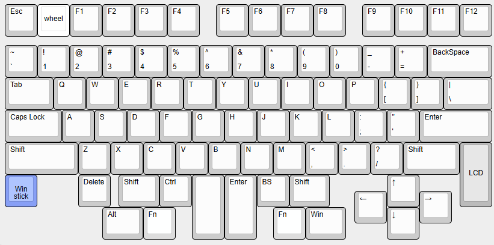
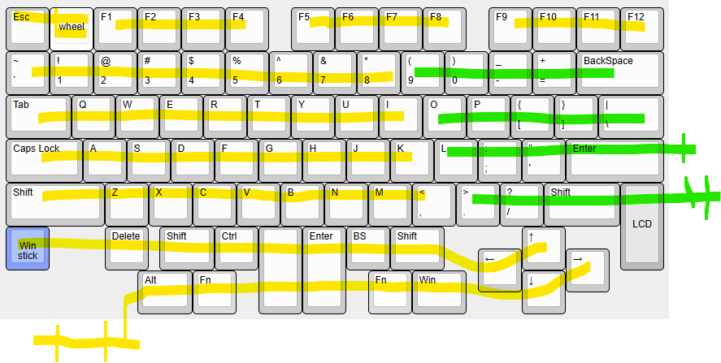
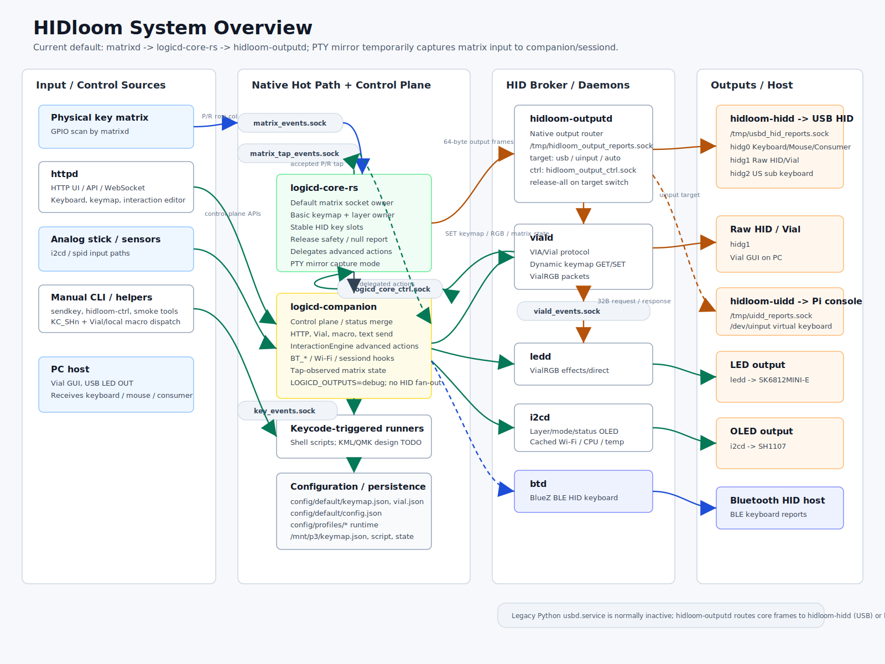

# HIDloom

HIDloomは、Linux SBCをprogrammable keyboard applianceとして動かすsoftware projectです。GPIO matrix / charlieplex scan、USB HID gadget、BLE HID keyboard/mouse、Vial、HTTP UI、LED/OLED表示、analog stick、runtime keymapをまとめて扱います。`cqa02303v5`は最初のdevice profileです。



## まず見る

- 導入方式を選ぶ: [INSTALL.md](INSTALL.md)
- Raspberry Pi Zero 2 W keyboardを試す: [Keyboard Package and M6 Image](docs/hardware/raspberry-pi-zero-2-w-keyboard-release.md)
- Raspberry Pi 4 touch panelを試す: [Touch Panel Package](docs/hardware/raspberry-pi-4-touch-panel-package.md)
- 詳細ドキュメント目次: [docs/README.md](docs/README.md)
- 画像ギャラリー: [docs/gallery/README.md](docs/gallery/README.md)

- メインターゲット: Raspberry Pi Zero 2 W
- 開発・貢献手順: [CONTRIBUTING.md](CONTRIBUTING.md)
- 公開sourceからの再現build: [docs/ops/public-source-rebuild-runbook.md](docs/ops/public-source-rebuild-runbook.md)
- 公開文書とprivate運用資料の境界: [docs/ops/public-documentation-boundary.md](docs/ops/public-documentation-boundary.md)
- 実機失敗パターン: [docs/ops/failure-patterns.md](docs/ops/failure-patterns.md)
- MCP 診断サーバ: [docs/ops/keyboard-mcp-server.md](docs/ops/keyboard-mcp-server.md)
- Security: [SECURITY.md](SECURITY.md)
- Support: [SUPPORT.md](SUPPORT.md)
- Community conduct: [CODE_OF_CONDUCT.md](CODE_OF_CONDUCT.md)

## インストール方式を選ぶ

公開 Release では、同じ source revision から作成した3つの構成を選べます。

| 方式 | 適した用途 | 配布物 |
|---|---|---|
| Raspberry Pi OS Keyboard | Raspberry Pi Zero 2 Wでの通常運用、開発、ネットワーク管理 | `hidloom-core` + `keyboard-ver1` profileの`.deb` |
| Raspberry Pi OS Touch Panel | Raspberry Pi 4 + Waveshare 8.8inch DSI touch kiosk | `hidloom-core` + `touch-waveshare-8.8` profileの`.deb` |
| Buildroot M6 image | 高速起動する offline keyboard appliance | `hidloom-<version>-buildroot-m6.img.zst` |

選択基準、Release asset、導入手順: [INSTALL.md](INSTALL.md)。Zero 2 W向けのpackageとM6は
[Keyboard Package and M6 Image](docs/hardware/raspberry-pi-zero-2-w-keyboard-release.md)にまとめています。

## Keyboard Layout

- [Keyboard Layout Editor - CQA02303v5](https://www.keyboard-layout-editor.com/##@@_y:0.5%3B&=Esc&_c=%23ffffff&a:7%3B&=wheel&_c=%23cccccc&a:4%3B&=F1&=F2&=F3&=F4&_x:0.5%3B&=F5&=F6&=F7&=F8&_x:0.5%3B&=F9&=F10&=F11&=F12%3B&@_y:0.25%3B&=~%0A%60&=!%0A1&=%2F@%0A2&=%23%0A3&=$%0A4&=%25%0A5&=%5E%0A6&=%2F&%0A7&=*%0A8&=(%0A9&=)%0A0&=%2F_%0A-&=+%0A%2F=&_w:2%3B&=BackSpace%3B&@_w:1.5%3B&=Tab&=Q&=W&=E&=R&=T&=Y&=U&=I&=O&=P&=%7B%0A%5B&=%7D%0A%5D&_w:1.5%3B&=%7C%0A%5C%3B&@_w:1.75%3B&=Caps%20Lock&=A&=S&=D&=F&=G&=H&=J&=K&=L&=%2F:%0A%2F%3B&=%22%0A'&_w:2.25%3B&=Enter%3B&@_w:2.25%3B&=Shift&=Z&=X&=C&=V&=B&=N&=M&=%3C%0A,&=%3E%0A.&=%3F%0A%2F%2F&_w:1.75%3B&=Shift&_c=%23bbbbbb&a:7&h:2%3B&=LCD%3B&@_c=%23879ff5&a:4%3B&=Win%0A%0A%0A%0A%0A%0A%0A%0A%0A4,0%0Astick&_x:1.25&c=%23cccccc%3B&=Delete&_x:0.25&w:1.25%3B&=Shift&=Ctrl&_a:7&h:2%3B&=&_a:4&h:2%3B&=Enter&=BS&_w:1.25%3B&=Shift&_x:1.75%3B&=%E2%86%91%3B&@_y:-0.5&x:10.75%3B&=%E2%86%90&_x:1%3B&=%E2%86%92%3B&@_y:-0.5&x:3&w:1.25%3B&=Alt&_c=%23dddddd%3B&=Fn&_x:3%3B&=Fn&_c=%23cccccc&w:1.25%3B&=Win&_x:1.25%3B&=%E2%86%93%3B&@_y:-0.5&x:1%3B&=UP%0A%0A%0A%0A%0A%0A%0A%0A%0A0,0%3B&@=LEFT%0A%0A%0A%0A%0A%0A%0A%0A%0A1,1&_x:1%3B&=RIGHT%0A%0A%0A%0A%0A%0A%0A%0A%0A2,2&_x:0.25%3B&=UP%0A%0A%0A%0A%0A%0A91B%3B&@_x:1%3B&=DOWN%0A%0A%0A%0A%0A%0A%0A%0A%0A3,3&_x:1.25%3B&=DOWN%0A%0A%0A%0A%0A%0A91A)



## システム概要

現在の構成は、Raspberry Pi Zero 2 W を USB HID 複合デバイス兼 BLE HID keyboard/mouse として動かし、Vial GUI / HTTP UI / 実キー入力を `logicd-core-rs` / `logicd-companion` / `hidloom-outputd` の runtime keymap と output control plane に集約します。



詳細: [docs/architecture/system-overview.md](docs/architecture/system-overview.md)

```text
matrixd / httpd / i2cd / sendkey
        ↓
      logicd-core-rs + logicd-companion  ── keymap / layer / macro / output control
        ↓
      hidloom-outputd ── USB HID gadget / uinput
        └ logicd-companion ── BLE HID via btd
        ↓
PC / Linux input / log / Bluetooth host
```

主要 daemon:

| daemon | 役割 |
|---|---|
| `matrixd` | GPIO matrix scan |
| `hidloom-logicd-core` / `logicd-companion` | keymap、layer、macro、HID report、output routing |
| `hidloom-outputd` | native output router。`usb` / `uinput` / `bt` / `auto` target へ broker frame を配送 |
| `hidloom-hidd` | USB HID gadget owner、Raw HID / Vial packet bridge、LED OUT bridge |
| `hidloom-uidd` | Pi local console 用 uinput report sink。`KC_CONSOLE` の `uinput` target |
| `usbd` | legacy USB bridge / rollback path |
| `viald` | Vial protocol、VialRGB、Matrix Test |
| `httpd` | HTTPS UI、keymap editor、Lighting、Key Tester |
| `i2cd` | OLED 表示、alert、analog stick 入力 |
| `ledd` | LED animation / VialRGB direct control |
| `btd` | BLE HID over GATT keyboard/mouse backend |
| `spid` | SPI mouse sensor motion input |

出力先の内部名と表示名:

| 内部名 | UI / OLED 表示 | 意味 |
|---|---|---|
| `gadget` | USB | USB HID gadget |
| `bt` | BT | Bluetooth HID |
| `uinput` | Pi | Raspberry Pi local input |
| `debug` | Debug | HID report log |

## Repository Layout

root 直下は、導入入口と主要 daemon の位置を見失わないための薄い入口として残しています。

| Path | 役割 |
| --- | --- |
| `system/install/`, `system/systemd/` | install script 実体、systemd unit source |
| `config/default/`, `config/boards/` | repository default config、board profile config |
| `build/generated/`, `build/generators/` | tracked generated data、生成 helper |
| `dev/mcp/keyboard/` | Codex / MCP read-only keyboard diagnostics server |
| `tools/` | 実機操作、計測、手動 smoke helper |
| `script/` | regression suite、install/systemd 直呼び helper、既存 live smoke 入口 |
| `daemon/logicd/`, `daemon/http/`, `daemon/matrixd/`, `daemon/i2cd/`, `daemon/ledd/`, `daemon/usbd/`, `daemon/viald/`, `daemon/btd/`, `daemon/spid/` | Python / native daemon 本体 |
| `setup_fresh_rpi.sh`, `setup_usb_gadget.sh`, `getkeymap.sh`, `setkeycode.sh` | root 互換 wrapper / 操作入口 |

## 導入

fresh Raspberry Pi OS では、まず project build を行わない platform 準備だけを実行します。

```bash
sudo ./setup_fresh_rpi.sh --prepare-only
```

準備後の再起動が完了したら、x86_64 build host で作成した同じ version の
`hidloom-core` と device profile package を同時に install し、profile を適用します。

```bash
sudo apt-get install -y \
  /tmp/hidloom-core_<version>_arm64.deb \
  /tmp/hidloom-profile-keyboard-ver1_<version>_arm64.deb
sudo hidloom-profile keyboard-ver1 --apply --backup --restart
```

引数一覧は `./setup_fresh_rpi.sh --help` で確認できます。引数なしの checkout bootstrap は
実機 native build と package 管理外 unit install を行う legacy/recovery path です。

方式の選択: [INSTALL.md](INSTALL.md)

詳しい Raspberry Pi OS 導入手順: [FRESH_INSTALL.md](FRESH_INSTALL.md)

## 実機への反映

現在の標準反映手順は Debian package です。実機側 checkout での `git pull` や
native build は通常運用では使いません。

標準キーボード構成では、同じ version の core package と device profile package を
同時に install し、profile を明示適用します。

```bash
make core-deb-package
make keyboard-ver1-profile-deb
scp build/packages/hidloom-core_<version>_arm64.deb \
  build/packages/hidloom-profile-keyboard-ver1_<version>_arm64.deb \
  <user>@<keyboard-ip>:/tmp/
ssh <user>@<keyboard-ip> 'sudo apt-get install -y \
  /tmp/hidloom-core_<version>_arm64.deb \
  /tmp/hidloom-profile-keyboard-ver1_<version>_arm64.deb && \
  sudo hidloom-profile keyboard-ver1 --apply --backup --restart'
```

実際の package build / deploy / verify / rollback 手順は
[docs/ops/release-packaging-runbook.md](docs/ops/release-packaging-runbook.md) を正とします。

## Legacy / Recovery Deploy

checkout rsync、`/opt` release、pre-.deb layout は比較・復旧専用です。これらを使う場合も
project binary は x86_64 build host で ARM64 cross-buildし、Raspberry Pi 実機では build
しません。通常更新へ混在させず、先に dry-run と rollback path を確認します。

詳細は [tools/package/README.md](tools/package/README.md) と
[release-packaging-runbook.md](docs/ops/release-packaging-runbook.md) を参照してください。

## 動作確認

```bash
systemctl status hidloom-usb-gadget hidloom-hidd hidloom-uidd hidloom-outputd hidloom-logicd-core logicd-companion matrixd i2cd ledd httpd viald btd --no-pager
systemctl is-active logicd usbd || true  # legacy/rollback owner は通常 inactive
ls -l /dev/hidg0 /dev/hidg1
test ! -e /dev/hidg2 || ls -l /dev/hidg2
test ! -e /dev/hidg4 || ls -l /dev/hidg4
journalctl -u viald -u logicd-companion -u hidloom-logicd-core -u hidloom-outputd -u hidloom-uidd -u btd -u ledd -u hidloom-hidd -n 200 --no-pager
curl -k -u admin:$(hostname) https://127.0.0.1/api/status
```

USB gadget の割り当て:

| Device | 用途 |
|---|---|
| `/dev/hidg0` | Keyboard / Mouse / Consumer Control multi-report HID |
| `/dev/hidg1` | Raw HID / Vial |
| `/dev/hidg2` | Optional US sub keyboard HID |
| `/dev/hidg4` | Optional Windows IME custom HID |

## 現在含まれている主な機能

- GPIO matrix scan によるキー入力
- `logicd-core-rs` / `logicd-companion` による runtime keymap / layer / macro 処理
- USB HID keyboard / mouse / consumer control
- BLE HID over GATT keyboard/mouse backend
- Vial Raw HID bridge
- Vial GUI からの keymap 編集
- `.vil` keymap export / import
- VialRGB / LED direct control
- HTTP UI による keymap 編集・Lighting 操作・Key Tester
- OLED 表示 / alert 通知
- analog stick 入力
- `sendkey.py` による CLI キー入力
- `getkeymap.sh` / `setkeycode.sh` による runtime keymap 操作
- OutputRouter による `gadget/uinput/bt/debug` output backend モデル
- `debug` output による HID report ログ確認
- HTTP System panel からの Bluetooth Pair on/off
- LED video demo 再生の実験機能

## 詳細情報

| 項目 | ドキュメント |
|---|---|
| 詳細ドキュメント目次 | [docs/README.md](docs/README.md) |
| 導入方式の選択 | [INSTALL.md](INSTALL.md) |
| Raspberry Pi OSへの導入 | [FRESH_INSTALL.md](FRESH_INSTALL.md) |
| リリース確認 | [RELEASE_CHECKLIST.md](RELEASE_CHECKLIST.md) |
| 全体仕様・構成 | [docs/architecture/README.md](docs/architecture/README.md) |
| 方針・決定事項 | [docs/policy/README.md](docs/policy/README.md) |
| daemon / IPC | [docs/daemon/README.md](docs/daemon/README.md) |
| keycode / QMK / Vial 互換 | [docs/keycode/README.md](docs/keycode/README.md) |
| lighting / VialRGB | [docs/lighting/README.md](docs/lighting/README.md) |
| Bluetooth / BLE | [docs/bluetooth/README.md](docs/bluetooth/README.md) |
| MCP / Codex 診断 | [docs/ops/keyboard-mcp-server.md](docs/ops/keyboard-mcp-server.md) |
| MCP write-capable 境界設計 | [docs/policy/mcp-write-capable-tool-design.md](docs/policy/mcp-write-capable-tool-design.md) |
| Technical design backlog | [docs/feature/design-todo-backlog.md](docs/feature/design-todo-backlog.md) |
| 開発・貢献手順 | [CONTRIBUTING.md](CONTRIBUTING.md) |
| 実機失敗パターン | [docs/ops/failure-patterns.md](docs/ops/failure-patterns.md) |
| ドキュメント方針 | [docs/policy/documentation-policy.md](docs/policy/documentation-policy.md) |

## よく使う補助コマンド

```bash
./sendkey.py tap 0x04
./getkeymap.sh --pretty
./setkeycode.sh 7,0 KC_ESC
./script/showlog.sh -s all -f
```

詳細:

- [GETKEYMAP.md](GETKEYMAP.md)
- [SETKEYCODE.md](SETKEYCODE.md)
- [daemon/logicd/README.md](daemon/logicd/README.md)
- [daemon/http/README.md](daemon/http/README.md)
- [daemon/i2cd/README.md](daemon/i2cd/README.md)
- [daemon/viald/README.md](daemon/viald/README.md)
- [daemon/ledd/README.md](daemon/ledd/README.md)
- [daemon/usbd/README.md](daemon/usbd/README.md)

## ドキュメント運用

README は概要と入口に留め、長い手順・プロトコル詳細・設計メモは `docs/` 配下へ分割します。方針は [docs/policy/documentation-policy.md](docs/policy/documentation-policy.md) を参照してください。

## ライセンス

HIDloom自身のsource codeは[`GPL-3.0-or-later`](LICENSE)で提供します。
著作権は個々のcontributorに残り、包括的な権利譲渡は求めません。公開上の表記と
contribution条件は[`AUTHORS.md`](AUTHORS.md)と[`CONTRIBUTING.md`](CONTRIBUTING.md)を参照してください。
Buildroot、Linux kernel、BusyBox、Python/Rust dependencies、KiCad library、画像などの
第三者componentにはそれぞれのライセンスが適用されます。第三者componentの一覧と
再配布条件の確認状況は[`THIRD_PARTY_NOTICES.md`](THIRD_PARTY_NOTICES.md)に生成します。
公開exportはCycloneDX 1.7 `SBOM.cdx.json`と全export fileのSHA-256 manifestも生成します。
