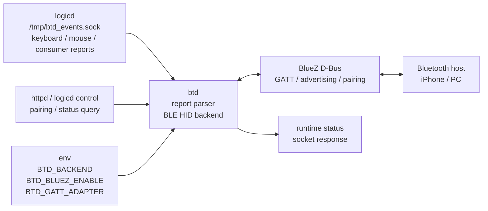

# btd

`btd` は Bluetooth HID backend を担当する daemon です。

Raspberry Pi Zero 2 W 実機では BlueZ D-Bus 経由の BLE HID over GATT keyboard/mouse として
iPhone への pairing / bonding / trust / connect / input notify を確認済みです。
開発・テスト用には dry-run adapter も残しています。

## 現在できること

- Unix domain socket で keyboard / mouse HID report と control frame を受け取る
- `daemon/btd/protocol.py` で `KeyboardReport` / `MouseReport` / control message として parse する
- BLE HID over GATT 用の UUID / Report Map / Input Report metadata を `daemon/btd/gatt_hid.py` に持つ
- BLE HID over GATT application の object path / service / characteristic model を `daemon/btd/gatt_app.py` に持つ
- BlueZ/D-Bus GATT application 登録 adapter を `daemon/btd/gatt_adapter.py` に持つ
- `BtdBackend` interface 経由で backend に渡す
- `LoggingBackend` で report を log する
- `BlueZBackend` で BLE HID over GATT keyboard/mouse service を公開できる
- daemon として起動・停止できる
- systemd unit の雛形がある
- `logicd` の BT output から keyboard / mouse / consumer report を受け取れる
- HTTP status 用の read-only runtime status control frame を返せる

## 担務 / 入出力 / config 図



## 起動

リポジトリ直下で:

```bash
PYTHONPATH=daemon python3 -m btd.btd
```

デフォルト socket:

```text
/tmp/btd_events.sock
```

## backend 選択

デフォルトは安全な logging backend です。

```bash
PYTHONPATH=daemon python3 -m btd.btd --backend logging
```

BlueZ backend も選択できます。デフォルトでは安全のため `enabled=False` で起動し、BlueZ へ接続しません。
`--bluez-enable` を付けると GATT adapter を実行します。

```bash
PYTHONPATH=daemon python3 -m btd.btd --backend bluez
```

BlueZ HID transport は **BLE HID over GATT のみ**を提供します。transport と btd socket protocol / packet size は独立しています。

```bash
PYTHONPATH=daemon python3 -m btd.btd --backend bluez
```

環境変数でも指定できます。

```bash
BTD_BACKEND=logging PYTHONPATH=daemon python3 -m btd.btd
BTD_BACKEND=bluez PYTHONPATH=daemon python3 -m btd.btd
```

実 BlueZ D-Bus 登録を試す場合:

```bash
PYTHONPATH=daemon python3 -m btd.btd --backend bluez --bluez-enable --gatt-adapter bluez-dbus
```

同じ指定は環境変数でもできます。

```bash
BTD_BACKEND=bluez BTD_BLUEZ_ENABLE=1 BTD_GATT_ADAPTER=bluez-dbus PYTHONPATH=daemon python3 -m btd.btd
```

`bluez-dbus` は Debian / Raspberry Pi OS の `python3-dbus-next` を必要とします。未導入の場合は backend だけを無効化し、`btd` daemon 自体は socket 受付を続けます。

```bash
sudo apt-get install python3-dbus-next
```

`bluez-dbus` を使うと、GATT application に加えて BLE advertisement も登録できます。
advertisement は HID service UUID、keyboard appearance、local name を公開します。
既定の `BTD_ADVERTISING_MODE=pairing` では、pairable / discoverable が有効な間だけ
advertisement を登録します。常時公開したい確認では `BTD_ADVERTISING_MODE=always`、
完全に止めたい時は `BTD_ADVERTISING_MODE=off` を使います。
明示的に advertising adapter を選ぶ場合:

```bash
BTD_BACKEND=bluez BTD_BLUEZ_ENABLE=1 \
  BTD_GATT_ADAPTER=bluez-dbus BTD_ADVERTISING_ADAPTER=bluez-dbus \
  BTD_ADVERTISING_MODE=always \
  PYTHONPATH=daemon python3 -m btd.btd
```

ペアリング確認までまとめて行う場合は、btd 起動中だけ pairable と BLE HID advertisement を
on にできます。iPhone で adapter discoverable と BLE advertisement が二重表示されるのを
避けるため、既定では adapter 全体の discoverable は on にしません。旧挙動が必要な確認では
`BTD_PAIRING_DISCOVERABLE=1` を指定します。
停止時には起動前の状態へ戻します。

```bash
BTD_BACKEND=bluez BTD_BLUEZ_ENABLE=1 \
  BTD_GATT_ADAPTER=bluez-dbus BTD_ADVERTISING_ADAPTER=bluez-dbus \
  BTD_ADVERTISING_MODE=pairing \
  BTD_PAIRING_MODE=1 BTD_PAIRING_ADAPTER=bluetoothctl BTD_PAIRING_AGENT=KeyboardOnly \
  PYTHONPATH=daemon python3 -m btd.btd
```

実機で host から見えるかを確認する時は、一時的な確認窓を開く helper も使えます。

```bash
python3 tools/btd_bluez_pairing_window.py --duration 120
```

実行中に PC / スマートフォン側の Bluetooth 設定から `<keyboard-host>` を探してペアリングします。
helper は BlueZ の discoverable / pairable / advertisement / connected devices と btd log tail を表示し、終了時に pairing mode と advertisement を元へ戻します。
helper 内では `BTD_STATUS_INTERVAL=5` を設定するため、btd log に `host_connected` や advertisement / pairing 状態も周期的に残ります。
pairing agent capability は既定で `KeyboardOnly` です。host 相性確認では `--pairing-agent NoInputNoOutput` や `--pairing-agent KeyboardDisplay` も試せます。
`bluetoothctl` agent は pairing window の間だけ常駐し、同じセッション内で `default-agent` を設定します。
`bluetoothctl devices Connected` は一時的な BLE link でも表示されることがあります。helper は `bluetoothctl info` の `Paired` / `Bonded` / `Connected` / `ServicesResolved` も表示するので、host UI 上の接続成立とは分けて見ます。

常用 systemd service のまま iPhone / host の再接続状態を観測する時は、別 helper を使います。
これは btd を起動し直さず、`bluetoothctl info`、HTTP `/api/status`、`journalctl -u btd` の reset marker をまとめて表示します。

```bash
python3 tools/bt_reconnect_watch.py --duration 120 --interval 2
```

stuck-key 防止のため、常用 service では接続中の確認に `BTD_DISCONNECT_MONITOR_INTERVAL=2` を設定しています。
未接続時は `BTD_DISCONNECT_IDLE_MONITOR_INTERVAL=60` へバックオフし、BlueZ / D-Bus の polling 負荷を下げます。
`logicd` の `BT_PAIRING_ON/OFF` は btd へ直接同期通知するため、通常の pairing 操作では idle poll を待ちません。
BlueZ の connected device が 0 になった時点で、Keyboard Input Report と Boot Keyboard Input Report の内部値を null report に戻します。
また、host が Input Report notification を開始した時にも keyboard input value を null report に戻します。

iPhone / host OS restart 後に BlueZ 上は `Connected=yes` へ戻っても HID Input Report notification が再開しないことがあります。
常用 service では `BTD_STUCK_RECONNECT_POLLS=3` と `BTD_STUCK_RECONNECT_COOLDOWN=30` を設定し、
connected device があるのに `host_connected=false` の状態が続いた場合、null report reset の後に
GATT application を再登録し、advertisement は `BTD_ADVERTISING_MODE` に従って復帰します。
`BTD_OUTPUT_ON_CONNECT=bt` を設定すると、connected device を検出した時点で btd から
logicd ctrl socket へ output target `bt` を通知し、Pairing/reconnect 後の入力先を
Bluetooth に切り替えます。`BTD_OUTPUT_ON_DISCONNECT=auto` を併用すると、全 host 切断後に
output target を `auto` へ戻します。

BLE host が保持中 keyboard report だけではキーリピートしない場合に備え、既定で
`BTD_KEYBOARD_REPEAT=1` と同等の補助リピートを有効にしています。通常キーを含む
非 null report だけを `BTD_KEYBOARD_REPEAT_DELAY` 後に、modifier を保持した
synthetic release / press として `BTD_KEYBOARD_REPEAT_INTERVAL` 間隔で再通知し、
実際の release / null report で停止します。

host が正式な pairing / bonding へ進まない場合は、GATT characteristic に暗号化を要求するモードを試せます。

```bash
python3 tools/btd_bluez_pairing_window.py --duration 120 --gatt-security encrypt --send-on-notify --disconnect-on-exit
```

`--gatt-security encrypt` は HID Report Map などの read に `encrypt-read`、Input Report notification に `encrypt-notify` を付けます。これは BlueZ GATT API の server characteristic flags です。

iPhone / host 側に「数字をこのキーボードで入力してください」と表示された場合は、その数字を helper へ渡して HID report として送れます。
logicd の passkey input mode は数字 / Enter / Backspace / Esc だけを捕まえます。数字入力が不要な再接続では、通常キー入力を消費しません。

```bash
python3 tools/btd_bluez_pairing_window.py --duration 120 --type-passkey 123456 --disconnect-on-exit
```

`--type-passkey` は数字列を打ったあと Enter も送ります。表示された数字が変わる場合は、その数字に置き換えます。

ペアリング窓を開いた後に数字が表示された場合は、別ターミナルから既存 socket へ送れます。

```bash
# terminal 1
python3 tools/btd_bluez_pairing_window.py --duration 120 --disconnect-on-exit

# terminal 2: iPhone に表示された数字へ置き換える
python3 tools/btd_bluez_pairing_window.py --send-passkey 123456
```

接続検出後に A press/release を一度だけ自動送信したい時:

```bash
python3 tools/btd_bluez_pairing_window.py --duration 120 --send-on-connect
```

host が HID Input Report notification を開始した後に A press/release を一度だけ自動送信したい時:

```bash
python3 tools/btd_bluez_pairing_window.py --duration 120 --send-on-notify
```

接続/notify の監視間隔は既定2秒です。必要なら `--poll-interval` で短くできます。

確認窓の間に新しく接続された host を終了時に切断したい時:

```bash
python3 tools/btd_bluez_pairing_window.py --duration 120 --disconnect-on-exit
```

## BLE HID over GATT

`daemon/btd/gatt_hid.py` には、BlueZ GATT application で使う定数を置いています。

含まれるもの:

- HID service UUID
- HID Information UUID
- HID Report Map UUID
- HID Control Point UUID
- HID Report UUID
- Protocol Mode UUID
- Report Reference descriptor UUID
- Client Characteristic Configuration descriptor UUID
- keyboard / mouse input report metadata
- 8-byte keyboard report payload validation

Keyboard Input Report は Report ID 1、Mouse Input Report は Report ID 2 として HID Report Map に定義します。
GATT Report characteristic の `Value` は `logicd -> btd` の payload と同じ長さに揃え、keyboard は 8 byte、mouse は 4 byte です。

`daemon/btd/gatt_app.py` には、BlueZ D-Bus ObjectManager application が公開する model を置いています。

含まれるもの:

- application object path
- HID service model
- HID Information characteristic model
- Report Map characteristic model
- Control Point characteristic model
- Protocol Mode characteristic model
- Keyboard Input Report characteristic model
- Mouse Input Report characteristic model
- Report Reference / CCCD descriptor model

`daemon/btd/gatt_adapter.py` には、BlueZ/D-Bus 登録層を差し替えるための adapter boundary を置いています。

含まれるもの:

- `GattRegistrationAdapter` protocol
- `DryRunGattRegistrationAdapter`
- `BlueZDbusGattRegistrationAdapter`
- `DryRunAdvertisingAdapter`
- `BlueZDbusAdvertisingAdapter`
- `DryRunPairingModeAdapter`
- `BluetoothctlPairingModeAdapter`
- GATT application register / unregister の dry-run
- BlueZ `GattManager1.RegisterApplication` / `UnregisterApplication`
- BlueZ `LEAdvertisingManager1.RegisterAdvertisement` / `UnregisterAdvertisement`
- btd 起動中だけ pairable / discoverable を有効化し、停止時に復元する pairing mode helper
- ObjectManager / GattService1 / GattCharacteristic1 / GattDescriptor1 export
- Device Information Service (manufacturer / model / USB identity profile共有のPnP ID)
- Battery Service (Battery Level)
- keyboard input report notify の dry-run
- notify-capable keyboard / mouse Input Report characteristic の Value 更新と StartNotify / StopNotify logging
- 8-byte payload validation
- status snapshot (`host_connected` は keyboard Input Report の notify 購読状態を反映)

dry-run は BlueZ 登録を行いません。`bluez-dbus` は opt-in で BlueZ 登録を行います。どちらも `logicd -> btd` の framed report と BLE Input Report characteristic の payload 境界は変えません。

## logicd から btd へ送る

`logicd` の OutputRouter で `bt` backend を有効にすると、keyboard / mouse HID report が btd socket へ送られます。

```bash
# btd 側: 受信した report を log する
PYTHONPATH=daemon python3 -m btd.btd --backend logging

# logicd 側: bt と debug へ同じ report を fan-out する
LOGICD_OUTPUTS=bt,debug PYTHONPATH=daemon python3 -m logicd.logicd
```

btd socket path は既定で `/tmp/btd_events.sock` です。開発時は両側で `BTD_EVENTS_SOCK` を同じ値にします。

```bash
BTD_EVENTS_SOCK=/tmp/test_btd.sock PYTHONPATH=daemon python3 -m btd.btd --backend logging
BTD_EVENTS_SOCK=/tmp/test_btd.sock LOGICD_OUTPUTS=bt,debug PYTHONPATH=daemon python3 -m logicd.logicd
```

`btd` が停止中、または socket が存在しない場合、`logicd` 側の `BtdReportSender` は report を drop します。`gadget` / `uinput` / `debug` など他 backend への出力は止めません。

HTTP `/api/status` からは read-only の status control frame を使って btd runtime status を取得します。
pairing on/off などの状態変更は HTTP API から `ctrl_events.sock` へ流し、`logicd` / `btd` の通常経路で扱います。

backend status を定期的にログへ出したい時は `BTD_STATUS_INTERVAL` または `--status-interval` を使います。

```bash
BTD_STATUS_INTERVAL=5 PYTHONPATH=daemon python3 -m btd.btd --backend bluez
```

## テスト送信

null keyboard report:

```bash
python3 script/send_btd_report.py
```

A key press の例:

```bash
python3 script/send_btd_report.py 0000040000000000
```

logging backend では次のように出る想定です。

```text
backend keyboard report null=False bytes=0000040000000000
```

## systemd

unit:

```text
system/systemd/btd.service
```

fresh install script の install / enable 対象です。
unit は `@HIDLOOM_REPO_ROOT@` を使うため、実機反映時に repo root へ置換します。
logging backend の検証用に `/tmp/btd_events.sock` は `BTD_SOCKET_MODE=666` で作成します。
BLE Device Information ServiceのPnP IDは`/etc/hidloom/usb-identity.env`から読み、
`hidloom-usb-gadget.service`と同じ`HIDLOOM_USB_VENDOR_ID` / `HIDLOOM_USB_PRODUCT_ID`を使用します。
このfileをUSBまたはBLEの片側だけに適用してはいけません。

手動反映する場合:

```bash
REPO_ROOT=/home/USERNAME/hidloom
sed "s|@HIDLOOM_REPO_ROOT@|$REPO_ROOT|g" "$REPO_ROOT/system/systemd/btd.service" | sudo tee /etc/systemd/system/btd.service >/dev/null
sudo systemctl daemon-reload
sudo systemctl enable --now btd.service
```

## 回帰テスト

```bash
python3 script/test_btd_protocol.py
python3 script/test_btd_backend.py
python3 script/test_btd_bluez_backend.py
python3 script/test_btd_backend_selection.py
python3 script/test_btd_gatt_hid.py
python3 script/test_btd_gatt_app.py
python3 script/test_btd_gatt_adapter.py
python3 script/test_btd_socket_boundary.py
python3 -m unittest tests.test_btd_sender
```

確認内容:

- raw 8-byte keyboard report と framed keyboard / mouse / consumer report の parse
- null report 判定
- backend interface の呼び出し
- stop 時 null report 方針
- BlueZ backend の dry-run GATT adapter lifecycle
- 公開CLIが未実装transport設定を持たないこと
- BLE HID over GATTが唯一の実装済みtransportであること
- BLE HID GATT UUID / Report Map / report metadata
- BLE HID GATT application / service / characteristic model
- GATT register / unregister / notify adapter 境界
- backend 選択
- 一時 Unix socket での daemon boundary
- logicd `BtdReportSender` から btd socket へ keyboard / mouse / consumer report を送る境界

## 現在の flow

```text
logicd OutputRouter
  ↓
BtdReportSender
  ↓ Unix socket
keyboard / mouse HID report or status control frame
  ↓
frame dispatch / legacy raw keyboard dispatch
  ↓
KeyboardReport / MouseReport / status response
  ↓
BtdBackend
  ↓
LoggingBackend or BlueZBackend
  ↓
DryRunGattRegistrationAdapter or BlueZDbusGattRegistrationAdapter
  ↓
DryRunAdvertisingAdapter or BlueZDbusAdvertisingAdapter
  ↓
DryRunPairingModeAdapter or BluetoothctlPairingModeAdapter
```

## 次の実装予定

1. iPhone / host OS restart 後の reconnect を確認する
2. Bluetooth off/on 時の stuck-key 有無を host 側で目視確認する
3. 複数 host / 複数 bond の扱いと、host 単位 rename / forget の設計 TODO を進める
4. Consumer Control GATT opt-in の設計 TODO で host OS 互換性確認手順を固定する
5. packet size / framing を変更する場合は、実装前に相談する

## 注意

- `btd` が落ちても `logicd` は落ちない設計にする
- 接続断時は必ず all key release を送る設計にする
- socket protocol を変更する場合は、logicd / btd / HTTP status の影響を合わせて確認する
