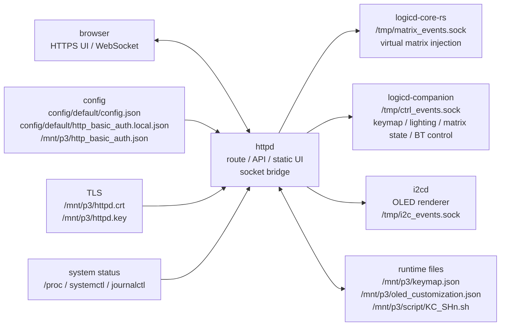

# キーボードWeb UI

`httpd` は HIDloom の HTTPS UI/API です。仮想キーボード、keymap 編集、`.vil` import/export、Lighting、内部 Matrix Tester、daemon status/log、Bluetooth pairing 操作を提供し、必要な入力は current input owner / `logicd-companion` の Unix socket へ中継します。

## 機能

| 機能 | 説明 |
| --- | --- |
| 仮想キーボード | ブラウザ上のキー操作を `logicd` 経由で USB HID / BLE HID 出力へ送信 |
| 物理キー転送 | ブラウザの物理キー入力を仮想キーボードに転送 |
| キーマップ変更 | GUI から runtime keymap を変更し、`/mnt/p3/keymap.json` へ保存 |
| `.vil` 入出力 | Vial GUI 互換の keymap JSON を export/import |
| Lighting | VialRGB mode、HSV、speed、direct frame を操作 |
| OLED | 1-bit icon編集、Ready画面の表示ON/OFF・行順・区切り線編集、browser preview、runtime override保存 |
| Matrix Tester | 内部 matrix pressed state を表示 |
| Scripts | `KC_SH0` から `KC_SH10` の runtime script を表示・編集 |
| Status / Logs | HID、出力先、基板 profile、Bluetooth、btd、spid、各 daemon の状態と journald log を表示 |
| Bluetooth pairing | BLE HID pairing の受付開始/停止、paired device 削除、状態確認 |
| Touch panel kiosk | `?keyboard=1` でキーボード専用表示、左上メニュー、確認付き shutdown、低遅延 pointer 入力 |
| Basic 認証 | 全ページ、API、WebSocket を Basic 認証で保護。Settings から password を変更可能 |

## 担務 / 入出力 / config 図



## 起動

```bash
cd /path/to/hidloom
script/ensure_httpd_tls_cert.sh /mnt/p3/httpd.crt /mnt/p3/httpd.key
python3 daemon/http/httpd.py
```

systemd では `HTTPD_PORT=443`、`HTTPD_TLS_CERT=/mnt/p3/httpd.crt`、`HTTPD_TLS_KEY=/mnt/p3/httpd.key` を設定します。自己署名証明書を使うため、ブラウザでは初回に証明書警告を許可してください。

## モジュール

`daemon/http/httpd.py` は route 定義、Basic 認証、WebSocket、socket bridge の入口です。
API の本体は機能別 module へ分割し、`httpd.py` には systemd から直接起動される入口と
基本通信部分を残します。起動時に repo root を `sys.path` へ追加します。

| ファイル | 責務 |
| --- | --- |
| `layout_api.py` | `/api/layout` payload、runtime layer 取得。`/mnt/p3/vial.json` があれば touch-panel 用 mapping を優先 |
| `layout_controls.py` | `_layout_def` 由来の joystick / encoder / click metadata |
| `keymap_api.py` | keymap active / remap / layer add-clear の HTTP handler 本体 |
| `lighting_api.py` | Lighting / matrix tester HTTP handler 本体 |
| `oled_api.py` | OLED customization取得・検証・atomic保存・reset・i2cd reload通知 |
| `settings_api.py` | Settings API の HTTP Basic auth 更新 handler 本体 |
| `scripts_api.py` | Script editor API、check-run / run 実行 handler 本体 |
| `security_api.py` | private-network 制限、CSRF、Basic auth、TLS helper |
| `socket_bridge.py` | Unix socket bridge、logicd query、WebSocket message handling |
| `status_api.py` | status / logs / Bluetooth pairing HTTP handler 本体 |
| `vil_api.py` | `.vil` import/export の HTTP handler 本体 |
| `script_store.py` | `KC_SHn.sh` の探索、label、runtime script 書き込み・削除 |
| `system_api.py` | output / Bluetooth / btd runtime / systemd environment status |
| `system_process.py` | process / HID gadget / Unix socket status |
| `system_peripherals.py` | spid / ledd direct-frame status |
| `system_logs.py` | journald log response |
| `bluetooth_api.py` | Bluetooth pairing API の on/off 制御と paired device 削除 |
| `keymap_actions.py` | keymap action 入力検証 |
| `lighting.py` | Lighting API の入力検証と metadata |
| `lighting_lock_indicators.py` | Lighting tab の Host lock LED 永続設定 helper |
| `matrix_state.py` | matrix tester 用 pressed state 正規化 |
| `static/keyboard.js` | layout 描画と仮想キー操作 |
| `static/remap_panel.js` | keymap remap と `.vil` import/export |
| `static/status_panel.js` | daemon status / log panel |
| `static/lighting_panel.js` | Lighting / VialRGB UI |
| `static/oled_panel.js` | JavaScript主体の1-bit icon / Ready layout editorとpreview |
| `static/matrix_tester.js` | 内部 Matrix Tester |
| `static/scripts_panel.js` | script viewer / editor |

全体の分割方針は [docs/architecture/module-structure.md](../../docs/architecture/module-structure.md) を参照してください。

## 環境変数

| 変数 | デフォルト | 説明 |
| --- | --- | --- |
| `HTTPD_HOST` | `0.0.0.0` | listen address |
| `HTTPD_PORT` | `443` | HTTPS listen port |
| `HTTPD_TLS_CERT` | `/mnt/p3/httpd.crt` | TLS 証明書 |
| `HTTPD_TLS_KEY` | `/mnt/p3/httpd.key` | TLS 秘密鍵 |
| `HTTPD_PRIVATE_ONLY` | `1` | `1` の時、loopback / IPv4 private / IPv4 link-local 以外の client を 403 で拒否 |
| `HTTPD_ALLOWED_NETS` | 空 | `HTTPD_PRIVATE_ONLY=1` のまま追加許可する CIDR。例: `100.64.0.0/10` |
| `HTTPD_AUTH_BYPASS_LOOPBACK` | `0` | `1` の時、loopback からの request だけ Basic 認証を省略。タッチパネル kiosk 用 |
| `HTTPD_SYSTEM_SHUTDOWN_COMMAND` | `sudo shutdown -h now` | `/api/system/shutdown` で起動する argv。空にすると shutdown API を無効化 |
| `HTTPD_BASIC_AUTH_FILE` | `/mnt/p3/http_basic_auth.json` または `config/default/http_basic_auth.local.json` | Settings で保存する認証 override |
| `MATRIX_EVENTS_SOCK` | `/tmp/matrix_events.sock` | virtual matrix injection bridge to the current input owner |
| `CTRL_EVENTS_SOCK` | `/tmp/ctrl_events.sock` | keymap / lighting / matrix state / Bluetooth control |
| `HIDLOOM_OLED_CUSTOMIZATION_FILE` | `/mnt/p3/oled_customization.json` | OLED icon / Ready layout runtime override |

Basic 認証の初期値は `config/default/config.json` の `settings.http_basic_auth` から読みます。未設定時の初期値は user `admin`、password は node 名（`hostname` コマンドの出力）です。Settings タブから password を変更した場合は `HTTPD_BASIC_AUTH_FILE` の小さな専用 JSON へ `password_hash` として保存し、`config/default/config.json` は書き換えません。

## URL

| パス | メソッド | 内容 |
| --- | --- | --- |
| `/` | GET | 仮想キーボード UI |
| `/api/layout` | GET | keyboard layout、Vial definition、runtime layer、内部 keycode 一覧 |
| `/api/status` | GET | HID、output、board profile、Bluetooth、interaction runtime、Text Send readiness、btd、HID broker readiness、spid、daemon status |
| `/api/logs?service=logicd&lines=100` | GET | journald log |
| `/api/keymap` | POST | 単一 keymap remap |
| `/api/keymap/reset` | POST | runtime keymap reset |
| `/api/keymap/layers` | POST | layer 追加 |
| `/api/keymap/layers/{layer}` | DELETE | layer 削除または初期化 |
| `/api/scripts` | GET | `KC_SHn` script 一覧 |
| `/api/scripts/{keycode}` | GET/PUT | script 取得・保存 |
| `/api/scripts/{keycode}/reset` | POST | runtime script reset |
| `/api/scripts/{keycode}/check-run` | POST | editor content を一時ファイルとしてチェック実行 |
| `/api/scripts/{keycode}/run` | POST | 保存済み script を通常実行 |
| `/api/vil/export` | GET | `.vil` export |
| `/api/vil/import` | POST | `.vil` import |
| `/api/interaction` | POST | OLED/LED interaction status 通知 |
| `/api/bluetooth/pairing` | POST | pairing 受付の on/off/toggle |
| `/api/bluetooth/forget` | POST | pairing 受付停止、接続切断、paired devices 削除 |
| `/api/bluetooth/hosts/{address}/forget` | POST | per-host forget の dry-run guard。confirmed address、connected warning、single-address command plan を返す |
| `/api/settings` | GET | Settings 表示用 metadata |
| `/api/settings/http-auth` | POST | Basic 認証 password 変更 |
| `/api/system/shutdown` | POST | OS shutdown を起動。UI では二段階確認を必須にする |
| `/api/lighting/*` | GET/POST | VialRGB / Lighting 操作 |
| `/api/lighting/lock-indicators` | GET/PUT | Host lock LED 表示設定 |
| `/api/oled` | GET/PUT | OLED既定値・runtime override取得、icon/layout保存と反映 |
| `/api/oled/reset` | POST | runtime override削除と既定表示への復帰 |
| `/ws` | WS | key event WebSocket |

すべての URL は HTTPS と Basic 認証が必要です。

## Security Notes

- HTTP から外部 command を呼ぶ箇所は `create_subprocess_exec()` で argv を分けて渡し、
  shell command line を文字列連結しない。
- `/api/logs` の `journalctl` service 名は allowlist で制限する。
- `.vil` export の `Content-Disposition` filename はヘッダ用に ASCII 安全文字へ丸める。
- httpd は default で IPv4 private / link-local / loopback 以外の client を拒否する。
  IPv6 は通常運用で使わない前提のため default 許可しない。必要な VPN / 管理 network は
  `HTTPD_ALLOWED_NETS` に CIDR で明示する。OS firewall は defense in depth として別途追加できるが、
  primary policy は repo 内で test できる httpd middleware に置く。
- POST / PUT / DELETE と `/ws` は CSRF token を要求する。`/` と API GET で
  `hidloom_csrf` cookie を配布し、frontend は `X-HIDLOOM-CSRF` header または WebSocket query で返す。
- `HTTPD_AUTH_BYPASS_LOOPBACK=1` は kiosk browser 用の局所 bypass。`request.remote` が loopback
  でない場合は有効にならないため、LAN / Wi-Fi 経由の UI は Basic 認証を維持する。
- `/api/system/shutdown` は認証・CSRF を通った POST だけを受け付ける。UI では `Shutdown` 押下で
  確認パネルを開き、`Shutdown now` の二回目操作でだけ実行する。既定 command は
  `sudo shutdown -h now` で、実行後は Raspberry Pi の物理電源投入が復帰経路になる。
- `/api/oled`のPUTとresetは認証・private-network制限・CSRFを通し、package payloadではなく
  `/mnt/p3/oled_customization.json`だけをatomic更新する。壊れたruntime fileは既定表示へfallbackする。
- `/api/scripts/{KC_SHn}/check-run` と `/api/scripts/{KC_SHn}/run` は、認証済みユーザーが
  script を `httpd` 権限で実行するための強い操作。これは command injection ではなく機能だが、
  editor UI では実行前確認を必須にする。危険 metadata / 自動検出に該当する script は、
  check-run、通常実行、保存して実行の前に追加確認を出す。script 保存 / check-run / run / reset、Bluetooth forget、
  keymap reset / layer 操作、VIL import などの強い操作は `AUDIT http` として journal に残す。
  外部公開時は Basic 認証と HTTPS を必須にする。

## Status Panel

`/api/status` は 3 秒ごとに polling されます。主な表示項目は次の通りです。

| 項目 | 内容 |
| --- | --- |
| HID Gadget | `/dev/hidg*` と UDC state |
| Output | `LOGICD_OUTPUTS` の設定、現在の出力先、USB/BLE の使用可否 |
| Board | `ver1.0` / `ver0.1` の active board profile と marker source |
| Interaction | Caps Word active、Repeat Key availability、Key Lock active count。Repeat history の action 名は表示しない |
| Text Send | Unicode / Send String の mode、host profile、runner readiness、named text validation count、blocking reasons |
| Bluetooth | adapter、paired/trusted/connected device、pairing 状態 |
| btd | BLE HID daemon の process、GATT backend、runtime status |
| hidd / hid_broker | USB HID report broker socket、native `hidloom-hidd` owner、legacy brokerまたはnative outputd routeのopt-in env、`broker_ready` |
| usbd | legacy USB HID broker compatibility payload。active owner が `hidloom-hidd` の場合も owner / readiness を反映する |
| spid | SPI 入力 daemon の process 状態 |
| ledd direct frame | VialRGB direct frame の状態 |
| services | `logicd` / `httpd` / `matrixd` / `ledd` / `viald` / `hidd` / `i2cd` / `btd` / `spid` |

## データフロー

```text
ブラウザキー操作 ─ WebSocket ─► httpd ─ /tmp/matrix_events.sock ─► logicd-core-rs
ブラウザ keymap  ─ HTTP POST ─► httpd ─ /tmp/ctrl_events.sock   ─► logicd-companion / logicd-core-rs
Matrix tester   ─ HTTP GET  ─► httpd ─ /tmp/ctrl_events.sock K ─► logicd-companion
ブラウザ pairing ─ HTTP POST ─► httpd ─ /tmp/ctrl_events.sock   ─► logicd-companion / btd

logicd-core-rs ─► hidloom-hidd ─► /dev/hidg0 keyboard
logicd-companion ─► ledd / i2cd / btd
```

出力先の表示はユーザー向け名称に寄せます。内部名 `gadget` は USB、`bt` は BT、
`uinput` は Pi として表示します。`auto` の場合は auto 指定と現在の実出力を併記します。

## Touch Panel Kiosk

`https://127.0.0.1/?keyboard=1` はタッチパネル専用の kiosk 表示です。通常の header、
status、tabs、toolbar を隠してキーボードを中央に拡大し、左上のメニューだけを残します。
従来の full UI へ戻す操作も左上メニューの `Show full UI` に集約します。

左上メニューの操作:

| 操作 | 内容 |
| --- | --- |
| Reload | 現在の kiosk UI を再読み込み |
| Keyboard only / Show full UI | キーボード専用表示と通常 UI を切り替え |
| Passthrough | ブラウザに接続した物理キーボード入力を仮想 keyboard へ転送 |
| Matrix tester | 内部 matrix pressed state の表示。通常運用では OFF 推奨 |
| Shutdown | 確認パネルを開く。`Shutdown now` で `/api/system/shutdown` を実行 |

タッチ入力は `PointerEvent` を優先し、`touch-action: none` で browser gesture 判定を避けます。
WebSocket では compact packet (`Prc` / `Rrc`, row/col は 16 進 1 文字) を使い、
JSON packet よりタップごとの処理量を下げています。これは仮想入力の注入経路で、物理キーの観測経路ではありません。
`Matrix tester` は `/api/matrix` polling と DOM 更新を行い、`ctrl_events.sock` の `K` response に含まれる tap-observed pressed state を表示します。

## 通信パケット

### `/ws`

WebSocket key event は compact packet または従来 JSON packet を受け付けます。
compact packet は 3 byte text です。

| Byte | 内容 | 値 |
| ---: | --- | --- |
| 0 | event | `P` または `R` |
| 1 | row | 16 進 1 文字 |
| 2 | col | 16 進 1 文字 |

例:

```text
P12
R12
```

JSON 形式 (`{"type":"keydown","row":1,"col":2}`) は互換のため残します。

### `matrix_events.sock`

仮想キー操作を current input owner へ注入するための socket です。native owner では `logicd-core-rs` が受け、物理キーと同じ keymap / layer / HID report 経路に入ります。
物理キーの表示・sniffing には使わず、Matrix Tester は `ctrl_events.sock` の `K` response を読みます。

4 byte 固定 packet です。

| Byte | 内容 | 値 |
| ---: | --- | --- |
| 0 | event | `P` または `R` |
| 1 | row | 16 進 1 文字 |
| 2 | col | 16 進 1 文字 |
| 3 | reserved | `\n` または `0x00` |

```bash
printf 'P04\n' | socat - UNIX-CONNECT:/tmp/matrix_events.sock
```

### `ctrl_events.sock`

JSON Lines protocol です。keymap、lighting、status、Bluetooth 制御を扱います。

```bash
echo '{"t":"M","l":0,"r":3,"c":4,"a":"KC_A"}' | socat - UNIX-CONNECT:/tmp/ctrl_events.sock
```

## 確認

```bash
systemctl is-active httpd hidloom-logicd-core logicd-companion hidloom-outputd btd ledd matrixd viald hidloom-hidd i2cd spid --no-pager
curl -k -u admin:$(hostname) https://127.0.0.1/api/status
curl -k -u admin:$(hostname) -X POST https://127.0.0.1/api/bluetooth/pairing \
  -H 'Content-Type: application/json' \
  -d '{"mode":"off"}'
curl -k -u admin:$(hostname) -X POST https://127.0.0.1/api/bluetooth/forget
sudo journalctl -u httpd -n 100 --no-pager
```
