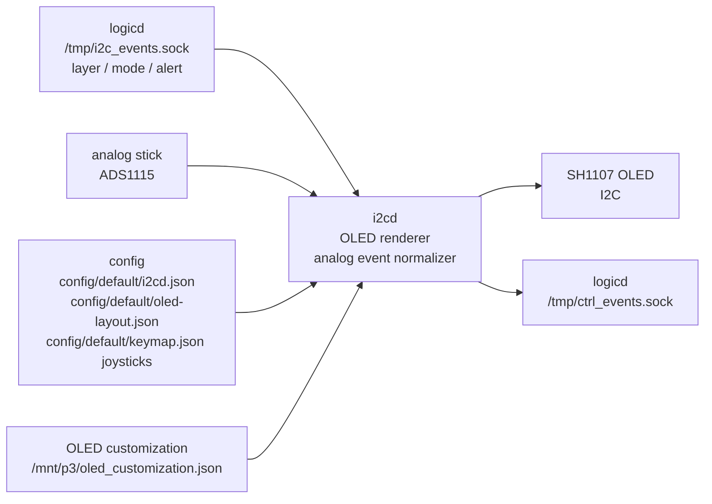

# i2cd

`i2cd` は、I2C 接続デバイスを扱う optional / support daemon です。
主に SH1107 OLED への status 表示、layer 表示、alert 表示、analog stick 由来の低頻度 control event を担当します。

## 役割

`i2cd` が持つ責務:

- I2C bus / OLED device の初期化
- boot / ready / layer / mode / service status の表示
- `logicd` からの layer / daemon status / alert / script exit 通知とnative outputd mode statusの表示
- analog stick など I2C 入力がある場合の正規化済み event 生成
- 起動中 daemon の簡易 status 表示

`i2cd` が持たない責務:

- keymap / layer 判定そのもの
- keyboard HID report 生成
- SPI mouse sensor の高頻度 motion 読み取り
- LED strip 直接出力
- Bluetooth / USB HID 処理

## 担務 / 入出力 / config 図



## spid との責務分担

`i2cd` と `spid` は、どちらも外部デバイス依存を `logicd` から分離するための daemon です。

```text
i2cd: I2C / OLED / analog stick / alert / low-rate status
spid: SPI / mouse sensor / high-rate motion stream
```

analog stick のような低頻度・状態的な入力は `ctrl_events.sock` に流せます。
一方、SPI mouse sensor の `dx/dy` motion は高頻度になりやすいため、`spid` では `spi_events.sock` を使います。

関連:

- [`daemon/spid/README.md`](../spid/README.md)
- [`docs/daemon/specs/spid/mouse-sensor-plan.md`](../../docs/daemon/specs/spid/mouse-sensor-plan.md)

## 通信経路

`i2cd` は `/tmp/i2c_events.sock` を listen し、`logicd` が client として接続します。

```text
logicd
  ↓ /tmp/i2c_events.sock JSON Lines
i2cd
  ↓ I2C
SH1107 OLED
```

`logicd` は接続できるまで polling するため、`i2cd` と `logicd` の起動順が多少前後しても復旧できます。

## Socket protocol

既定 socket:

```text
/tmp/i2c_events.sock
```

message は JSON Lines です。

代表例:

```json
{"t":"layer","layer":0,"active":[0]}
{"t":"mode","mode":"auto:gadget"}
{"t":"daemon_status","services":{"matrixd":true,"logicd-core":true,"logicd-companion":true,"outputd":true,"uidd":true,"ledd":true,"btd":false,"httpd":true,"hidd":true,"viald":true}}
{"t":"alert","msg":"Saved","sec":2.0}
{"t":"alert","msg":"MORSE main\n. PENDING\nKC_E","sec":0.7,"immediate":true}
{"t":"warning","msg":"Danger","sec":3.0,"immediate":true}
{"t":"script_exit","name":"KC_SH0","code":0}
{"t":"oled_config_reload"}
```

`alert` / `warning` は通常 FIFO queue に積まれ、現在表示中の alert が終わってから表示されます。
`immediate: true` を付けた場合だけ、queue を待たず現在表示を即座に置き換えます。
これは Morse 専用の判定ではなく、`alert` / `warning` 共通の表示制御フラグです。
`warning` または `level: "warning"` は反転表示になります。

## 表示内容

boot / ready 表示:

```text
cqa02303v5
[M][L][E][B][H][U][V]
Booting...
```

ready 後:

```text
[cqa02303v5]
[-02]
------------
[M][C][P][O][U]
[E][B][W][H][V]
[USB/auto/Wi]
------------
Layer: 0
[0,1]
CPU:34%
T:52C
```

実際の表示内容は実装と config により変わります。
node 名は 64px 幅に収まらない場合だけ最大 2 行に折り返します。
daemon icon は `logicd` が集約して `i2cd` に通知します。起動中も同じ icon 行を使い、ready は白背景に黒字、down / unknown は黒背景に白字で表示します。
daemon icon は 8行固定の bitmap file から読みますが、描画時は上下の空行を詰めるため、下端に余白を持たせた icon は詰めて表示されます。
daemon icon は 8px 幅に揃え、現行 10 daemon は 5 個ずつの 2 段表示にします。daemon block と下罫線の間には黒 1 ラインを置き、反転 badge が罫線へ触れないようにします。
接続 icon と daemon icon の形はどちらも `daemon/i2cd/connectivity_icon_bitmaps.txt` の 0/1 bitmap を編集して調整できます。
HTTP OLED editorで保存した場合はpackage既定bitmapを変更せず、`/mnt/p3/oled_customization.json`のiconを優先します。
Ready画面の各行も同じoverrideで表示ON/OFF、順序、区切り線を変更できます。Booting、alert、warning、shutdownは対象外です。

出力先の表示名はユーザー向けに揃えます。

| 内部名 | OLED 表示 |
|---|---|
| `gadget` or active `hidd` / `usbd` | USB |
| `bt` | BT |
| `uinput` | Pi |

明示的な`gadget` / `bt` / `uinput`と`auto:*`は実際の出力先を優先表示します。native output router使用時は
`/run/hidloom/outputd-status.json`をcanonical stateとして定期同期し、logicdのmode通知はstatus unavailable時のfallbackにします。
modeが未確定または`debug`だけの時は、USB HID transport (`hidd` / legacy `usbd`) がactiveならUSBをfallback表示します。
`auto` の時は auto 指定と現在選ばれている実出力を併記します。例: `AUTO USB`、`AUTO BT`、`AUTO Pi`。

## Configuration

主な設定ファイル:

```text
config/default/i2cd.json
config/default/oled-layout.json
/mnt/p3/oled_customization.json
```

主な項目:

| key | meaning |
|---|---|
| `oled.driver` | OLED driver name |
| `oled.i2c_port` | I2C bus number |
| `oled.address` | OLED I2C address |
| `oled.width` / `oled.height` | display size |
| `oled.rotate` | display rotation |
| `oled.recovery_cooldown_sec` | OLED `display()` 失敗後に再初期化を再試行する最短間隔。未指定時は 5 秒 |
| `display.refresh_interval_sec` | ready 画面の定期再描画間隔。未指定時は 5 秒 |
| `display.fps` | layer / mode / daemon status 変更時の OLED 更新上限 FPS。イベントはこの表示サイクルへ間引かれる |
| `display.wifi_poll_interval_sec` | Wi-Fi 状態を描画経路とは別に非同期検出する間隔。未指定時は 1 秒 |
| `display.wifi_connected_poll_interval_sec` | Wi-Fi 接続中の非同期検出間隔。未指定時は 5 秒 |
| `display.output_status_poll_interval_sec` | native outputd statusをOLED表示へ同期する間隔。未指定時は0.5秒 |
| `display.service_status_poll_interval_sec` | `systemctl is-active` によるサービス状態確認のキャッシュ間隔。未指定時は 5 秒 |
| `display.system_poll_interval_sec` | CPU 使用率 / 温度など軽量 system status を描画経路とは別に採取する間隔。未指定時は 1 秒 |
| `display.font_size` | font size |
| `display.font_path` | optional font path |
| `HIDLOOM_OLED_CUSTOMIZATION_FILE` | icon / Ready layout override path。未指定時は`/mnt/p3/oled_customization.json` |
| `ipc.i2c_socket` | logicd -> i2cd notification socket |
| `ipc.ctrl_socket` | i2cd -> logicd analog stick event socket |
| `ipc.outputd_status` | native output router status JSON。未指定時は`/run/hidloom/outputd-status.json` |
| `analog_stick.enabled` | ADS1115 analog stick polling |
| `analog_stick.address` | ADS1115 I2C address |
| `analog_stick.poll_interval` | ADS1115 active polling interval。既定は 0.02 秒程度の低レート入力 |
| `analog_stick.idle_poll_interval` | 中心付近で落ち着いた後の idle polling interval。既定は active interval 以上 |
| `analog_stick.idle_after_sec` | 最後の非中心入力から idle polling へ戻すまでの秒数 |
| `analog_stick.auto_center_on_start` | 起動直後に中心だけ runtime 測定する |
| `analog_stick.auto_center_duration` | 起動時中心測定の秒数。保存済み JSON は変更しない |
| `analog_stick.min_range_volts` | range 測定 / 保存値検査で両軸に要求する最小 span。未指定時は 0.1V |
| `analog_stick.x` / `analog_stick.y` | channel and voltage calibration |

## Analog Stick

ADS1115 が有効な場合、`i2cd` は AIN0 / AIN1 を読み、実測キャリブレーションで
`-100..100` の `x` / `y` に正規化して `logicd` の `ctrl_events.sock` へ送ります。
`center` / `low` / `high` は理論値ではなく、基板ごとに測った到達可能な電圧を保存します。

基板ごとの値を取り直す場合:

```bash
python3 tools/calibrate_ads1115_stick.py
python3 tools/calibrate_ads1115_stick.py --write
python3 tools/calibrate_ads1115_stick.py --phase center --write
python3 tools/calibrate_ads1115_stick.py --phase range --write
sudo python3 tools/calibrate_ads1115_stick.py --phase center --write --manage-i2cd-service
sudo python3 tools/calibrate_ads1115_stick.py --phase watch --sweep-duration 10 --manage-i2cd-service
python3 tools/calibrate_ads1115_stick.py --phase validate
```

1 回目は保存せず候補値だけを表示します。問題なければ `--write` で
`config/default/i2cd.json` の `analog_stick.x/y.center/low/high` を更新します。
board profile 側へ固定したい場合は `--config config/boards/ver1.0/conf/i2cd.json` のように
対象 JSON を指定します。
HTTP UI の Settings からも同じ測定を実行できます。中心測定はスティックを離してから実行し、
range 測定は測定中にスティックを大きく回します。HTTP UI では「測定」ボタンが dry-run、
「保存」ボタンが `config/default/i2cd.json` 更新です。
`Min span volts` は Settings GET の `min_range_volts` で初期化されます。`analog_stick.min_range_volts`
がある場合はその値、未指定時は 0.1V です。range 測定の誤操作防止しきい値と
「保存値を検査」の判定しきい値に使います。
Settings は現在保存されている `analog_stick.x/y.center/low/high`、low/high から計算した `span`、
center が low/high の内側にあるかを示す `center_valid`、span が最小しきい値以上かを示す
`span_valid`、両方を満たすかを示す `valid`、無効時の `errors` も表示します。
2026-06-09 以降は、同じ保存済み calibration と測定結果を merge した read-only 2D map も表示します。
map は center cross、deadzone circle、現在または測定結果の point、正規化後の X/Y 値を描きます。
live preview はまだ実装せず、HTTP 測定中だけ `i2cd` を一時停止する既存境界を維持します。
「保存値を検査」は ADS1115 を読まず、保存済み JSON の範囲妥当性を HTTP 経由で検査します。
HTTP 経由では `i2cd` の ADS1115 polling と競合しないよう、測定中だけ `i2cd` を一時停止し、
測定後に再起動します。CLI で daemon 起動中に測る場合は `--manage-i2cd-service` を付けます。
このオプションは systemd service を操作するため `sudo` で実行します。
`--phase watch` は保存せず、現在電圧・正規化値・測定中 span を表示します。
`--phase validate` は実機の ADS1115 を読まず、保存済み `center` が `low` / `high` の内側か、
両軸の `span` が `--min-range-volts` 以上かを検査します。
HTTP API で `range` を保存する場合は、誤操作防止のため `confirm_range=true` が必要です。

推奨手順:

1. スティックから手を離して `center` を保存する。
2. `watch` で raw voltage と normalized value が動くことを確認する。
3. `range` を dry-run し、測定中にスティックを外周まで大きく回す。
4. `range` の `low` / `high` が妥当なら `--write` または HTTP UI で保存する。

`range` は両軸の測定 span が小さすぎる場合、未操作または操作不足として保存を拒否します。
これにより、スティックを回していない状態の狭い範囲で誤って最大 / 最小を上書きしません。

基準実測値:

| direction | AIN0 | AIN1 |
|---|---:|---:|
| center | 1.5569 V | 1.5042 V |
| up | 2.6895 V | 1.7264 V |
| down | 0.3764 V | 1.5582 V |
| left | 1.5083 V | 0.4046 V |
| right | 1.4663 V | 2.6999 V |

この配線では上下軸が AIN0、左右軸が AIN1 です。`logicd` 側の座標は
`config/default/keymap.json` の `joysticks` 定義に従います。

## systemd

unit:

```text
system/systemd/i2cd.service
```

操作例:

```bash
sudo systemctl start i2cd
sudo systemctl restart i2cd
sudo systemctl status i2cd
journalctl -u i2cd -f
```

通常は fresh install script が unit を配置します。

## 実行

直接実行する場合:

```bash
PYTHONPATH=daemon python3 -m i2cd.i2cd
```

I2C device へアクセスするため、実機環境では権限や I2C 有効化が必要です。

## 実機確認

確認コマンド:

```bash
systemctl status i2cd
journalctl -u i2cd -f
ls -la /tmp/i2c_events.sock
```

I2C device 確認:

```bash
i2cdetect -y 1
```

OLED が `0x3c` などで見えるか確認します。

## Troubleshooting

### OLED が表示されない

確認すること:

- I2C が OS で有効か
- OLED address が `config/default/i2cd.json` と一致しているか
- wiring / power / pull-up が正しいか
- `i2cd` が起動しているか

### I2C は見えるが OLED 表示だけ固まる

別環境で頻発したため、2026-06-09 に
`OLED freeze recovery / I2C diagnostics` を TODO へ昇格しました。
疑う順番は OLED VCC の瞬断 / 電圧降下、SDA / SCL / GND の noise、OLED controller hang です。

切り分け:

- USB 電源と cable を強くし、LED brightness / Wi-Fi / Bluetooth 動作との相関を見る。
- OLED 近くへ 0.1uF と 10-100uF 程度の bypass capacitor を追加する。
- SDA / SCL / GND を短くし、GND を太く共通化する。
- I2C speed を 100kHz へ落とす候補を確認する。
- pull-up が強すぎ / 弱すぎないか確認する。目安は 4.7kΩ、配線条件によって 2.2kΩ。

software first slice は、OLED 描画例外や stale display を検知した時に cooldown 付きで
OLED を再初期化し、I2C / 電源 / noise を切り分ける log を残す方針です。

### layer 表示が更新されない

確認すること:

- `hidloom-logicd-core` と `logicd-companion` が起動しているか
- `/tmp/i2c_events.sock` が存在するか
- `logicd-companion` が i2cd socket へ接続できているか

### alert が出ない

`logicd-companion` 側の alert 送信 log と `i2cd` log を確認します。

```bash
journalctl -u hidloom-logicd-core -u logicd-companion -f
journalctl -u i2cd -f
```

## 関連ドキュメント

- [`daemon/logicd/README.md`](../../daemon/logicd/README.md)
- [`docs/architecture/module-structure.md`](../../docs/architecture/module-structure.md)
- [`daemon/spid/README.md`](../spid/README.md)
