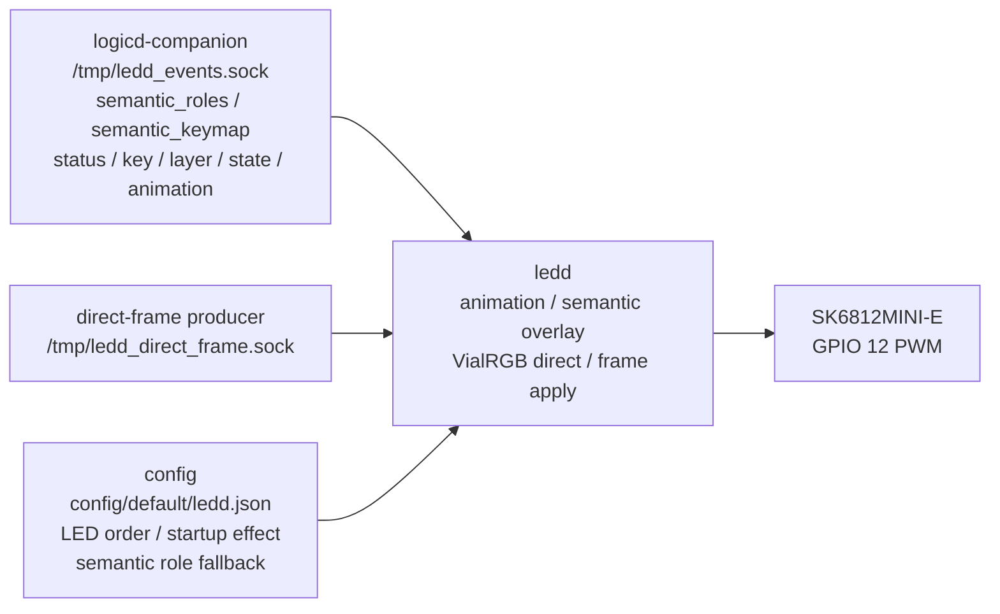

# ledd

`ledd` は HIDloom の LED daemon です。
SK6812MINI-E の keyboard backlight / animation / VialRGB direct 相当の描画を担当します。

## 役割

`ledd` が持つ責務:

- LED strip / `rpi_ws281x` への最終出力
- 通常 animation の再生
- layer / key event / HID mode に応じた LED 表示
- semantic role / state overlay による modifier / layer / lock 表示の維持
- VialRGB direct 相当 frame の反映
- `ledd direct-frame socket` による内部高速 LED frame 受信と frame apply

`ledd` が持たない責務:

- keymap / layer 判定そのもの
- keyboard HID report 生成
- Vial protocol 処理
- LED video demo など producer 側の frame 生成

## 担務 / 入出力 / config 図



## 現在の通常経路

通常の LED 通知は `logicd-companion` が `/tmp/ledd_events.sock` を提供し、`ledd` が接続します。
`ledd` 自体は早期起動し、接続前は `ledd.json` の `startup_effect` に従って低輝度の起動中表示を出します。
既定の `semantic_roles.load_keymap_on_startup=false` では、この段階で `keymap.json` を読みません。
semantic role 定義と keymap layer は、`logicd-companion` 接続時の `semantic_roles` / `semantic_keymap`
初期同期で受け取ります。`ledd` 側の file reload は互換・診断用 fallback として残します。

```text
logicd-core-rs matrix tap / httpd / viald
  ↓
logicd-companion
  ↓ /tmp/ledd_events.sock JSON Lines
ledd
  ↓ GPIO 12 PWM
SK6812MINI-E
```

主な message:

```json
{"t":"layer","layer":0,"active":[0]}
{"t":"key","kind":"P","row":7,"col":0}
{"t":"anim","id":1}
{"t":"mode","mode":"gadget"}
{"t":"led_state","state":"caps_lock","active":true}
{"t":"lock_state","name":"alert","on":false}
{"t":"semantic_roles","semantic_roles":{"roles":{"KC_A":"normal"}}}
{"t":"semantic_keymap","layers":[{"0,0":"KC_A"}]}
```

## Semantic role / state overlay

`ledd` は `logicd-companion` から届く layer / key / state を表示へ反映します。
通常は `logicd-companion` から push される `semantic_roles` と `semantic_keymap` から、
LED の意味を animation とは別に扱います。互換 fallback を有効にした場合だけ、
`config/default/keymap.json` の base layer と `config/default/ledd.json` の `semantic_roles` を直接読みます。

現在の runtime 方針:

- keycode から `normal` / `modifier` / `function` / `layer` / `lock` / `script` / `system` を推定する。
- `modifier` / `function` / `layer` / `lock` は既定で reactive / splash trigger から除外する。
  `semantic_roles.reactive.modifier_triggers_effects=true` の時だけ modifier も反応対象にする。
- active layer は `layer_1` のような state overlay として表示できる。
- host から返る Caps / Num / Scroll などの Keyboard LED Output Report は、
  `logicd` 経由の state overlay として表示できる。
- `config/default/ledd.json` の `0,0` / `1,1` / `2,2` / `3,3` / `6,1` / `7,0` / `7,1`
  は splash 系の着火位置として使うダミー定義で、単独 LED の肉眼確認には使わない。
- key 押下だけで lock overlay を local toggle する fallback はデバッグ用で、通常は無効にする。
- 複数 overlay が同じ key に乗った場合は `priority` が高い overlay を優先する。
  `layer:1` / `layer:2` のような layer overlay 同士で priority が同じ場合は、
  keymap 解決と同じく数字が大きい active layer の色を優先する。
- animation / VialRGB renderer / BT indicator / direct-frame restore 後も、base frame に overlay を重ね直す。
- LED Effect tab での pattern / splash / reactive 簡易 editor と long-run metrics は、実装前設計 TODO へ昇格済み。

既定では `caps_lock` と layer key overlay を用意します。必要なら `config/default/ledd.json` に次のような
`semantic_roles` を追加して上書きできます。

```json
"semantic_roles": {
  "state_overlays": {
    "layer_1": {"keys": ["LT(1,KC_SPACE)"], "color": [0, 70, 96], "priority": 30},
    "caps_lock": {"keys": ["KC_CAPS"], "color": [0, 0, 96], "priority": 40},
    "alert": {"keys": ["KC_CAPS"], "color": [96, 0, 0], "priority": 90}
  },
  "reactive": {
    "modifier_triggers_effects": true,
    "exclude_roles": ["function", "layer", "lock"]
  }
}
```

確認:

```bash
python3 script/test_led_semantic_roles.py
python3 script/test_logicd_host_led_output.py
python3 script/test_logicd_host_led_reader.py
```

## direct LED pattern / video demo の方針

`tools/demo/play_led_video.py` など高 FPS の direct LED pattern では、通常経路が長くなりやすいです。

```text
tools/demo/play_led_video.py
  ↓
viald
  ↓
logicd
  ↓
ledd
```

この経路は互換性には良い一方で、write 回数、JSON encode/decode、daemon 間 hop、細かい chunk 処理が増えます。

そのため、内部高速 path として次の構成を追加しています。

```text
tools/demo/play_led_video.py or internal LED producer
  ↓ ledd direct-frame socket
1 packet = 1 full LED frame
  ↓
ledd
  ↓
LED strip
```

詳細は [`docs/daemon/specs/ledd/direct-frame-socket-plan.md`](../../docs/daemon/specs/ledd/direct-frame-socket-plan.md) を参照してください。

この高速 path は **既存 VialRGB direct 互換経路を置き換えるものではありません**。互換経路は残し、内部 producer 用に別 socket / 別 packet として追加する方針です。

## direct-frame packet / socket

`daemon/ledd/direct_frame.py` と `daemon/ledd/direct_frame_socket.py` には、direct-frame socket で使う helper を置いています。

現在できること:

- `LDF1` header の encode / decode
- `frame_id` / `led_count` / `format` / `flags` / payload length validation
- RGB / GRB payload の扱い
- invalid packet を拒否して metrics に記録
- `/tmp/ledd_direct_frame.sock` の listen receiver
- validated frame を `AnimationManager.apply_direct_frame()` で LED buffer へ反映
- stale frame id を無視
- producer disconnect 時の `keep_last_frame` / `off` / `restore_default` fallback
- `restore_default` 後に semantic state overlay を再表示
- `tools/demo/play_led_video.py --backend ledd-direct` からの direct-frame 送信
- VialRGB 独自 mode `1002` (`Direct Multisplash`) 選択中は、direct-frame を動画ベースとして保持し、キー入力起点の multisplash を重ねて表示
- LED hardware なしで packet / socket / apply / fallback helper test を実行

次に本格利用する時に見ること:

- 長時間再生時の FPS / CPU / dropped frame 測定
- 実機目視では `Direct Multisplash` の動画 + splash 合成は十分な見え方を確認済み。残る観測は長時間メトリクスに寄せる。

確認:

```bash
python3 script/test_ledd_direct_frame.py
python3 script/test_ledd_direct_frame_socket.py
python3 script/test_ledd_direct_frame_apply.py
python3 script/test_ledd_direct_frame_fallback.py
python3 script/test_led_semantic_roles.py
```

## Hardware

| 項目 | 値 |
|---|---|
| LED | SK6812MINI-E |
| GPIO BCM | 12 |
| Board pin | 32 |
| LED count | 81 on `ver1.0`; 89 on prototype `ver0.1` |
| Color order | GRB |
| Library | `rpi_ws281x` |

設定は主に `config/default/ledd.json` にあります。

重要:

- `leds` の記述順は LED chain の物理順として扱います。
- `color_order` は実機の表示色がずれる場合に確認します。
- `rpi_ws281x` がない環境では stub mode で動作し、LED 実出力は行いません。

## Files

```text
daemon/ledd/
  ledd.py                 daemon entrypoint
  semantic_roles.py       semantic role / state overlay normalization
  direct_frame.py         direct-frame packet helper
  direct_frame_socket.py  direct-frame socket receiver
  ledd.service            systemd unit template
  animations/             animation implementations
  README.md               this document

config/default/
  ledd.json               LED hardware / animation config
  keymap.json             compatibility fallback for semantic role inference
```

関連:

- [`daemon/ledd/animations/README.md`](animations/README.md)
- [`docs/daemon/specs/ledd/direct-frame-socket-plan.md`](../../docs/daemon/specs/ledd/direct-frame-socket-plan.md)
- [`docs/daemon/specs/ledd/direct-frame-fallback.md`](../../docs/daemon/specs/ledd/direct-frame-fallback.md)
- [`docs/lighting/vialrgb-protocol.md`](../../docs/lighting/vialrgb-protocol.md)
- [`demo/README.md`](../../demo/README.md)

## Run

通常は systemd で起動します。

```bash
sudo systemctl start ledd
sudo systemctl stop ledd
sudo systemctl restart ledd
sudo systemctl status ledd
journalctl -u ledd -f
```

直接実行する場合:

```bash
cd /path/to/hidloom
sudo PYTHONPATH=daemon python3 -m ledd.ledd
```

`/dev/mem` へアクセスするため、実 LED 出力には通常 root 権限が必要です。

## systemd

unit template:

```text
system/systemd/ledd.service
```

fresh install では `setup_fresh_rpi.sh` が unit の配置、repo path の置換、enable を行います。

起動順の基本方針:

```text
local-fs.target -> ledd.service
logicd-core / matrixd -> logicd-companion.service -> ledd state sync
```

`ledd.service` は `logicd-companion.service` に依存しません。
boot 中は `startup_effect` を表示し、`logicd-companion` が起動して `/tmp/ledd_events.sock` を提供すると再接続して、
layer / mode / VialRGB / overlay state の初期同期で本来の表示へ上書きされます。

## Configuration

`config/default/ledd.json` の主な項目:

| key | meaning |
|---|---|
| `led.gpio_bcm` | LED output GPIO |
| `led.brightness` | default brightness |
| `led.color_order` | `GRB` / `RGB` / `BGR` |
| `led.show_min_interval_sec` | 最終 `show()` の最小間隔。未指定時は従来通り即時送信。Zero profile では 0.05 秒 |
| `animation.fps` | normal animation FPS |
| `animation.default_id` | default animation id |
| `startup_effect` | logicd-companion 接続前に ledd 単独で出す起動中エフェクト。`enabled=false` または `null` で無効化 |
| `ipc.socket_path` | logicd notification socket |
| `ipc.direct_frame_socket_path` | optional ledd direct-frame socket path |
| `ipc.direct_frame_fallback` | direct-frame producer disconnect fallback |
| `semantic_roles` | semantic role / state overlay override |
| `semantic_roles.load_keymap_on_startup` | `false` なら起動時 keymap fallback を使わず、logicd-companion からの `semantic_keymap` 同期を待つ |
| `leds` | LED physical order and coordinates |

## Animation

Built-in examples:

| ID | name | purpose |
|---|---|---|
| 0 | `bounce` | chain bounce animation |
| 1 | `ripple` | key press ripple animation |

`ANIM(N)` action で animation を切り替えます。

```json
"0,1": "ANIM(0)",
"0,2": "ANIM(1)"
```

新しい animation 追加手順は [`animations/README.md`](animations/README.md) を参照してください。

## Troubleshooting

### LED が光らない

確認:

```bash
systemctl status ledd
journalctl -u ledd -n 100
ls -la /tmp/ledd_events.sock
systemctl status logicd-companion
```

見る点:

- `logicd-companion` が起動しているか
- `ledd` が `/tmp/ledd_events.sock` に接続できているか
- `rpi_ws281x` が使える環境か
- GPIO / PWM / wiring が正しいか
- `config/default/ledd.json` の LED count / color order が実機と一致しているか

### 色がおかしい

`config/default/ledd.json` の `led.color_order` を確認します。

起動中の breathing で色が激しく乱れる場合は、`startup_effect` や
Python 割り込みより先に LED 端子のはんだ付けを確認します。ランドとの
接続だけに頼った細い接点では起動時の電源変動や初期フレームで DIN / GND /
VDD が不安定になりやすいため、端子周囲を広く覆うようにはんだを乗せて
機械的にも電気的にも接触面積を確保します。
