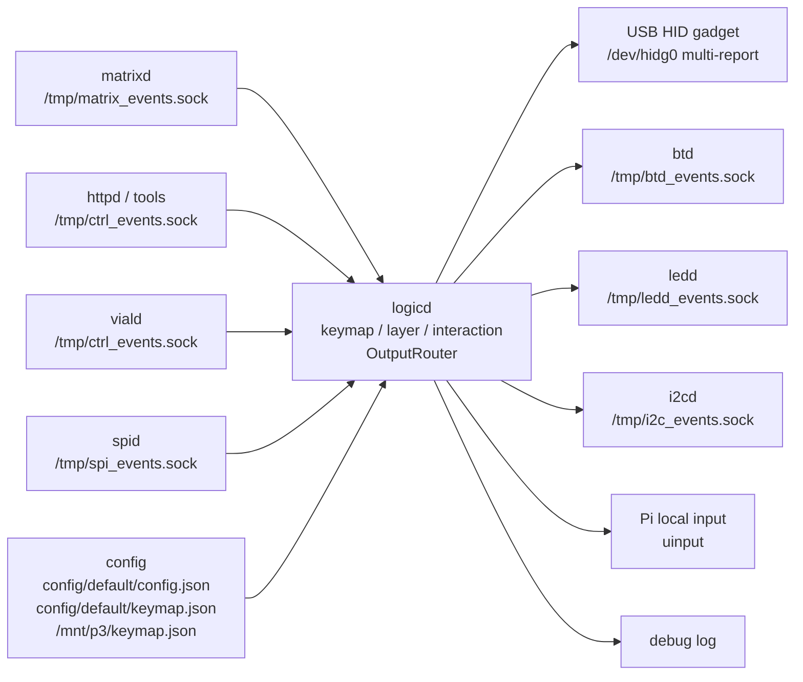

# logicd

`logicd` は、matrix event を keymap / layer / interaction に通し、HID report と daemon 間通知へ変換する中心 daemon です。

## 役割

`logicd` が持つ責務:

- `matrixd` から matrix press / release を受け取る
- keymap / layer / action を解釈する
- InteractionEngine を通して tap-hold / combo / tap dance / key override などを処理する
- keyboard HID report を作る
- OutputRouter で `gadget` / `uinput` / `bt` / `debug` へ fan-out する
- `btd` へ Bluetooth 用 keyboard / mouse report を送る
- `spid` motion stream を mouse report または virtual direction action に変換する
- `i2cd` / `ledd` へ layer / mode / status を通知する
- HTTP UI / Vial / runtime tool からの control event を処理する

`logicd` が持たない責務:

- GPIO matrix scan
- SPI / I2C low-level device access
- BlueZ / Bluetooth service registration
- LED hardware 直接出力
- Vial Raw HID packet の USB bridge

## 担務 / 入出力 / config 図



## 全体の位置づけ

```text
matrixd
  ↓ /tmp/matrix_events.sock
logicd
  ├─ keyboard HID report
  │    └─ OutputRouter: gadget / uinput / bt / debug
  ├─ ledd status / LED event
  ├─ i2cd status / OLED alert
  ├─ btd keyboard report sender
  └─ spid motion consumer
```

## 主な socket

| socket | 方向 | 内容 |
|---|---|---|
| `/tmp/matrix_events.sock` | matrixd/httpd -> logicd | matrix press / release |
| `/tmp/key_events.sock` | sendkey/internal -> logicd | confirmed key event |
| `/tmp/ctrl_events.sock` | daemon/i2cd/daemon/usbd/spid/tools -> logicd | JSON control event |
| `/tmp/ledd_events.sock` | logicd -> ledd | LED status / key / animation event |
| `/tmp/i2c_events.sock` | logicd -> i2cd | OLED / mode / status notification |
| `/tmp/btd_events.sock` | logicd -> btd | keyboard / mouse HID report、status control frame |
| `/tmp/spi_events.sock` | spid -> logicd | high-rate mouse sensor motion stream |

`ctrl_events.sock` の `HOST_LED` は host から返る keyboard LED Output Report を受ける入口です。
例: `{"t":"HOST_LED","report":2}` は HID 標準 bit1 の Caps Lock を表します。
`settings.host_led_output.states` で有効にした種類だけが `ledd` の state overlay へ反映されます。

## matrix input priority

`/tmp/matrix_events.sock` は物理キー入力の入口です。
`matrixd` は scan を担当し、`logicd` は受け取った matrix event を keymap / layer / interaction / HID report へ進めます。

優先度設計では `matrixd` だけを強くしすぎず、`logicd` の matrix event 受信と keyboard HID report 生成も飢餓させないことを重視します。
理想の相対優先度は次の順です。

```text
matrixd >= logicd matrix input path > daemon/usbd/btd output path > ledd/httpd/UI系
```

現時点の `logicd.service` には RT 優先度設定はありません。
実機なしでは service 設定を変更せず、multi splash 中の ghost / 取りこぼし確認時に、次を観測してから見直します。

- `matrixd` が送信失敗を出していないか。
- `logicd` が `/tmp/matrix_events.sock` 受信を遅らせていないか。
- HID report 出力が遅れて release が遅延していないか。
- `ledd` や `httpd` の負荷で input path が詰まっていないか。

matrix input path は段階ごとに責務を分けます。

```text
matrix socket intake:
  4 byte packet parse / range check / queue put

matrix_pipeline.event_processor:
  queue wait / interaction timer / process_matrix_event dispatch

process_matrix_event:
  pressed_matrix update / ledd key event / InteractionEngine resolved event dispatch

handle_resolved_action:
  layer / lighting / BT / Wi-Fi / macro / output preparation / HID report action
```

BT / Wi-Fi / macro / output preparation など重い可能性がある処理は `handle_resolved_action()` 側の action-level branch に限定し、raw matrix socket intake や `process_matrix_event()` へ戻さない方針です。
`handle_resolved_action()` が肥大化する場合は、[logicd-resolved-action-handler-split-design.md](../../docs/daemon/logicd-resolved-action-handler-split-design.md) に従い action family ごとの private helper 分割を検討します。

関連:

- [`../matrixd/README.md`](../matrixd/README.md)
- [`../../docs/daemon/specs/matrixd/runtime-priority-ideal.md`](../../docs/daemon/specs/matrixd/runtime-priority-ideal.md)
- [`../../docs/daemon/specs/matrixd/scan-stability-plan.md`](../../docs/daemon/specs/matrixd/scan-stability-plan.md)
- [`../../docs/daemon/logicd-resolved-action-handler-split-design.md`](../../docs/daemon/logicd-resolved-action-handler-split-design.md)

## OutputRouter

`logicd` の keyboard output は OutputRouter で扱います。

現在の output backend:

- `gadget`
- `uinput`
- `bt`
- `debug`

方針:

- backend は接続先の on/off として扱う
- 複数 backend に同時 fan-out できる
- `bt` backend は `btd` socket へ keyboard / mouse HID report を送る
- `debug` backend は report を log へ出す
- 旧 `LOGICD_OUTPUT_BACKEND=log` 制御は削除済み

関連:

- [`docs/daemon/logicd-output-router.md`](../../docs/daemon/logicd-output-router.md)
- [`docs/daemon/logicd-log-output.md`](../../docs/daemon/logicd-log-output.md)
- [`daemon/btd/README.md`](../btd/README.md)

## InteractionEngine

`logicd` は QMK/Vial 互換に近い advanced action を処理します。

主な対象:

- `MO(N)` / `TG(N)` / `TO(N)` / `DF(N)`
- `OSL(N)`
- `LT(N,kc)`
- `MT(mod,kc)`
- `TT(N)`
- Space Cadet
- Combo
- Tap Dance
- Key Override

実機の tap / hold 体感値は `docs/TODO_PRIORITY.md` と `docs/ops/real-device-test-checklist.md` で追跡します。

## btd 連携

Bluetooth HID output は `btd` に分離しています。

```text
logicd OutputRouter bt backend
  ↓ /tmp/btd_events.sock
keyboard / mouse HID report
  ↓
btd
```

`btd` が停止中でも、`logicd` は落ちずに report を drop します。

出力先の内部名は `gadget` / `bt` / `uinput` ですが、HTTP UI と OLED ではそれぞれ
USB / BT / Pi と表示します。`auto` では auto の指定と、現在選ばれている実出力を併記します。

## spid 連携

SPI mouse sensor は `spid` に分離します。

低頻度 status / connect request は `ctrl_events.sock` で受けます。
高頻度 motion は `spi_events.sock` で受けます。

```text
spid
  ├─ ctrl_events.sock: SPID_CONNECT / SPID_STATUS / SPID_DISCONNECT
  └─ spi_events.sock: dx / dy / wheel / buttons
logicd
  ├─ direct mouse report
  └─ virtual direction action
```

`logicd` は起動時に勝手に `spi_events.sock` へ接続しません。
`SPID_CONNECT` または `SPID_STATUS ready` を受けた時だけ接続します。

高頻度 motion では keyboard 処理の安定性を優先し、coalesce / rate-limit / bounded buffer / stale drop を許容します。

関連:

- [`daemon/spid/README.md`](../spid/README.md)
- [`docs/daemon/specs/spid/mouse-sensor-plan.md`](../../docs/daemon/specs/spid/mouse-sensor-plan.md)

## Control JSON

`ctrl_events.sock` は JSON Lines です。

例:

```json
{"t":"A","stick":0,"x":512,"y":-128}
{"t":"M","l":1,"r":3,"c":5,"a":"KC_A"}
{"t":"SPID_CONNECT","socket":"/tmp/spi_events.sock"}
{"t":"SPID_DISCONNECT"}
```

高頻度 motion は `ctrl_events.sock` へ流しません。

## Files

```text
daemon/logicd/
  logicd.py                  daemon entrypoint
  ctrl.py                    ctrl_events JSON dispatcher
  input_events.py            matrix / analog input handling
  interaction_engine.py      tap-hold / combo / tap dance / key override
  key_event_pipeline.py      confirmed key event output flow
  output_router.py           multi-backend output fan-out
  btd_sender.py              logicd -> btd socket sender
  spid_motion.py             spid motion -> mouse report
  spid_direction.py          spid motion -> virtual direction tap request
  hid_report.py              keyboard / mouse HID report helpers
  macro.py                   macro / mouse-key handling
```

## Run

通常は systemd で起動します。

```bash
sudo systemctl start hidloom-logicd-core logicd-companion
sudo systemctl restart hidloom-logicd-core logicd-companion
sudo systemctl status hidloom-logicd-core logicd-companion
journalctl -u hidloom-logicd-core -u logicd-companion -f
```

直接起動は isolated development fixture だけで使います。標準実機では native core と
companion の service split を維持してください。

```bash
PYTHONPATH=daemon python3 -m logicd.logicd
```
