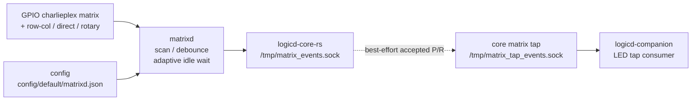

# matrixd

`matrixd` は、Raspberry Pi Zero 2 W の GPIO を使ってキースイッチ matrix を scan し、押下 / 離放イベントを `logicd` へ送る daemon です。

このプロジェクトの入力入口です。

## 役割

`matrixd` が持つ責務:

- GPIO pin の初期化
- charlieplex matrix scan
- row / col 分離 matrix scan
- 1 GPIO 1 switch の direct switch scan
- 2 GPIO rotary encoder phase scan
- key press / release の検出
- debounce / scan timing の管理
- `logicd-core-rs` への matrix event 送信

`matrixd` が持たない責務:

- keymap / layer 判定
- macro / tap-hold / combo / tap dance 処理
- HID report 生成
- Bluetooth / USB / uinput 出力
- LED / OLED 表示

これらは主に `logicd` 以降の責務です。

## 担務 / 入出力 / config 図



## 通信経路

```text
GPIO inputs
  charlieplex matrix / row-col matrix / direct switch / rotary encoder
  ↓
matrixd
  ↓ reliable /tmp/matrix_events.sock
logicd-core-rs
  ├─ keymap / layer / interaction / output routing
  └─ best-effort accepted matrix tap /tmp/matrix_tap_events.sock
       ↓
     logicd-companion / diagnostic testers / event sniffers
       ↓
     LED reactive trigger / HTTP or Vial key tester
```

`matrixd` は matrix 座標だけを送ります。
どの keycode / action にするかは `logicd-core-rs` または委譲先の `logicd-companion` が keymap と layer 状態を使って決めます。
`/tmp/matrix_events.sock` は入力本線で、matrixd は送信成功後に debounce state を commit します。
`/tmp/matrix_tap_events.sock` は core が受理した通常 matrix edge を流す観測用の副経路です。
接続や送信に失敗しても入力本線を止めません。

## Socket protocol

既定 socket:

```text
/tmp/matrix_events.sock
/tmp/matrix_tap_events.sock
```

event format:

```text
P[ROW_HEX][COL_HEX]\n
R[ROW_HEX][COL_HEX]\n
```

例:

```text
P34\n
R34\n
```

意味:

| prefix | 意味 |
|---|---|
| `P` | press |
| `R` | release |

`ROW_HEX` と `COL_HEX` は row / col を 1 桁 hex (`0`-`F`) で表すため、packet は常に 4 byte です。
tap socket も同じ P/R packet を受けます。現在の標準構成では `logicd-core-rs` が tap の送信元です。
`ledd` は press だけを reactive trigger として使い、HTTP / Vial tester や sniffer は必要に応じて release も読める前提です。

## Input scan types

`matrixd` はすべての入力を既存の matrix 座標 event (`P/R row col`) へ正規化します。
これにより、`logicd` 以降の keymap / layer / encoder / HID 出力経路は同じまま使えます。

| type | config | 用途 |
|---|---|---|
| charlieplex matrix | `matrix.matrix_type="charlieplex"` | 既存の row / col が同じ GPIO 群を共有する配線 |
| row-col matrix | `matrix.matrix_type="row_col"` | row GPIO と col GPIO を別々に持つ通常マトリクス |
| direct switch | `direct_switches[]` | 1 GPIO に 1 switch を接続する追加キー |
| rotary encoder | `rotary_encoders[]` | 2 GPIO の A/B 相を既存 encoder 用の仮想 matrix 座標へ変換 |

既定は互換性のため `charlieplex` です。`row_col` では `skip_same_index` の既定が `false` になります。
`matrix_type="none"` にすると matrix scan を止め、`direct_switches` / `rotary_encoders` だけを使えます。

この project の標準基板では配線方式として charlieplex を使います。

関連ドキュメント:

- [`docs/hardware/charlieplex-specification.md`](../../docs/hardware/charlieplex-specification.md)
- [`docs/hardware/complete-matrix-coordinates.md`](../../docs/hardware/complete-matrix-coordinates.md)
- [`docs/hardware/keyswitch-matrix-map.md`](../../docs/hardware/keyswitch-matrix-map.md)

## Row-col matrix

row と col を別 GPIO 群として指定する通常マトリクスは、次のように定義します。

```json
{
  "matrix": {
    "matrix_type": "row_col",
    "rows": 3,
    "cols": 4,
    "row_gpios": [5, 6, 13],
    "col_gpios": [16, 19, 20, 21],
    "row_drive": "output_low",
    "col_pull": "pull_up",
    "key_active": "low"
  }
}
```

## Direct switches

1 GPIO に 1 switch を付ける追加キーは `direct_switches` に定義します。
`row` / `col` は `logicd` に渡す仮想 matrix 座標です。

```json
{
  "direct_switches": [
    {
      "row": 8,
      "col": 2,
      "gpio": 17,
      "pull": "up",
      "active": "low"
    }
  ]
}
```

## Rotary encoders

2 GPIO とコンデンサを使う通常のロータリーエンコーダーは `rotary_encoders` に定義します。
`gpio_a` / `gpio_b` は物理GPIO、`a` / `b` は `logicd` の matrix-backed encoder 定義と同じ仮想 matrix 座標です。

```json
{
  "rotary_encoders": [
    {
      "gpio_a": 16,
      "gpio_b": 20,
      "a": [7, 1],
      "b": [6, 1],
      "pull": "up",
      "active": "low"
    }
  ]
}
```

方向が逆の場合は、`logicd` 側の encoder binding で `reverse=true` を使います。
現状の protocol は `P/R row col` のままなので、複数 encoder も各 A/B に異なる仮想座標を割り当てます。

## Scan timing

`config/default/matrixd.json` の `scan` で、全行 scan 後の `interval_us`、row drive 後の
`settle_us`、row release 後の `post_row_settle_us`、`debounce_mode` / `debounce_ms` を設定します。

通常時は `interval_us` の scan rate を維持します。`idle_interval_us` /
`deep_idle_interval_us` を設定すると、raw matrix に変化がない時間だけ scan 後の wait を
段階的に伸ばします。キー変化または press / release event を検出したら即座に
`interval_us` へ戻ります。

既定値:

```json
{
  "scan": {
    "interval_us": 1000,
    "idle_interval_us": 2000,
    "deep_idle_interval_us": 4000,
    "idle_after_ms": 100,
    "deep_idle_after_ms": 500,
    "debounce_mode": "time",
    "debounce_ms": 5,
    "settle_us": 20,
    "post_row_settle_us": 2
  }
}
```

この設定では、無操作 100ms 後に 2ms wait、500ms 後に 4ms wait へ移ります。
入力が始まると fast scan に戻るため、tap / hold や combo などの体感に近い経路では
通常の `interval_us` が使われます。

`settle_us` は row を drive してから col を読むまでの待ち時間です。
`post_row_settle_us` は row を INPUT に戻してから次rowへ進むまでの待ち時間です。
チャーリープレックスで row 間干渉、残留電荷、Space など特定座標の短時間 ghost を疑う場合は、
まず `debounce_mode=time` を試し、それでも残る場合に `settle_us` / `post_row_settle_us` を少しずつ増やします。

`interval_us` は高優先度実行時の busy loop を避けるため、実装側で安全下限を持ちます。
0や負値など危険な設定は丸められます。

初期化時に全 scan line の pull-up/down を設定し、通常の scan loop では row を
OUTPUT から INPUT に戻すだけにします。これにより、各 row ごとの pull 再設定に伴う
短い sleep とレジスタ書き込みを避けます。

必要なハードウェア条件で旧挙動へ戻したい場合だけ、`scan` に次を追加します。

```json
{
  "scan": {
    "reapply_pull_each_scan": true
  }
}
```

## Debounce modes

`matrixd` は `debounce_mode` で debounce 方式を選べます。

| mode | 意味 | 用途 |
|---|---|---|
| `count` | 連続して同じ raw を読んだ scan 回数で確定する既存互換方式 | 既存設定の互換維持 |
| `time` | 同じ raw が `debounce_ms` 以上継続した時に確定する実時間方式 | 可変scan周期や高優先度scanで推奨 |

既定は互換性のため `count` です。
`count` では `debounce_count` が指定されていればそれを使い、0 の場合は `debounce_ms * 1000 / interval_us` から scan 回数を計算します。

`time` では、デバウンス中に raw 確認回数が増えても `debounce_ms` 未満では press / release を確定しません。
`interval_us` / `idle_interval_us` / `deep_idle_interval_us` による可変scan周期は維持しつつ、確定条件だけを実時間の安定継続へ寄せます。

推奨例:

```json
{
  "scan": {
    "debounce_mode": "time",
    "debounce_ms": 5
  }
}
```

関連:

- [`docs/daemon/specs/matrixd/scan-stability-plan.md`](../../docs/daemon/specs/matrixd/scan-stability-plan.md)
- [`docs/daemon/specs/matrixd/variable-scan-debounce-note.md`](../../docs/daemon/specs/matrixd/variable-scan-debounce-note.md)
- [`docs/daemon/specs/matrixd/runtime-priority-ideal.md`](../../docs/daemon/specs/matrixd/runtime-priority-ideal.md)

## logicd との関係

`matrixd` は `logicd` より低い層です。

```text
matrixd: physical scan / matrix coordinate
logicd: keymap / layer / interaction / HID report
```

`matrixd` 側では `BT_STATUS` や `LT(1,KC_A)` などの action 名は扱いません。
それらは `logicd` が keymap から解釈します。

実行優先度としては、`matrixd` だけを強くしすぎると `logicd` が socket 受信や HID report 生成を進めにくくなる可能性があります。
理想は `matrixd >= logicd input path > usbd/btd output path > ledd/httpd` の順で、入力経路全体が飢餓状態にならないことです。
現時点では `logicd.service` に RT 優先度設定はありません。実機なしでは変更せず、実機確認時に `logicd` の受信遅延や journal warning を確認してから見直します。

## systemd

unit:

```text
system/systemd/matrixd.service
```

`matrixd` は物理 scan event を最初に拾う daemon なので、systemd unit では
`Nice=-20`、`CPUSchedulingPolicy=fifo`、`CPUSchedulingPriority=99`、
`IOSchedulingClass=realtime` を指定し、入力取りこぼしを避けるため最優先で動かします。

ただし、`matrixd` だけをRT最優先にした結果、`logicd` がイベントを処理できない状態は避けます。
`debounce_mode=time`、`post_row_settle_us`、設定値下限チェックを入れても ghost / 取りこぼしが残る場合は、
優先度設定も切り分け対象にします。

rollback例:

```bash
sudo systemctl edit matrixd
```

一時的にRT優先度を外す drop-in 例:

```ini
[Service]
CPUSchedulingPolicy=other
IOSchedulingClass=best-effort
Nice=0
```

`CPUSchedulingPriority=` や `IOSchedulingPriority=` を空で書くと systemd が warning を出す場合があります。
一時比較では上のように policy / class / Nice だけを上書きします。

反映:

```bash
sudo systemctl daemon-reload
sudo systemctl restart matrixd
systemctl show matrixd -p Nice -p CPUSchedulingPolicy -p CPUSchedulingPriority -p IOSchedulingClass -p IOSchedulingPriority
```

操作例:

```bash
sudo systemctl start matrixd
sudo systemctl stop matrixd
sudo systemctl restart matrixd
sudo systemctl status matrixd
journalctl -u matrixd -f
```

通常は fresh install script が unit を配置します。

## 実機確認

matrix event が出ているか確認する場合:

```bash
journalctl -u matrixd -f
journalctl -u hidloom-logicd-core -u logicd-companion -f
```

一時的に logicd-core 側へ matrix event を注入する場合は、実機確認 tool を使います。

```bash
python3 tools/matrix_action_runtime.py --help
```

追加 input scan type を安全に確認する場合は、通常の `matrixd.service` を止めず、別 socket と一時 config で
一時 `matrixd` を並走させます。未使用 GPIO を pull-up / active-low で読むだけなら、物理操作なしで
「起動できること」「浮きで event が出ないこと」「idle 時に CPU が暴れないこと」を確認できます。

2026-06-14 に `<keyboard-host>` で、`GPIO7/8/11/16` を row、`GPIO17/18/19/20` を col、
`GPIO21` を direct switch、`GPIO14/15` を rotary encoder A/B とする一時 config を
`/tmp/matrixd-extra-test.sock` へ接続して 5 秒実行しました。
通常 `matrixd` / `logicd` は active のまま、追加 instance の event は 0 bytes、CPU は最大 0.9% でした。

GPIO14/15 は UART と共有されるため、本配線で使う場合は serial console / UART 利用状況を確認します。

## Troubleshooting

### キー入力が来ない

確認すること:

- `matrixd` が起動しているか
- GPIO pin 定義が実配線と合っているか
- charlieplex の row / col 座標が正しいか
- `/tmp/matrix_events.sock` が存在するか
- `hidloom-logicd-core` と `logicd-companion` が起動しているか

確認コマンド:

```bash
systemctl status matrixd hidloom-logicd-core logicd-companion --no-pager
journalctl -u matrixd -u hidloom-logicd-core -u logicd-companion -n 100 --no-pager
ls -la /tmp/matrix_events.sock
```

### 特定キーだけ反応しない

- soldering / diode-less charlieplex wiring の確認
- matrix coordinate map の確認
- 隣接キーとの ghost / short の確認

関連:


## 注意

- `matrixd` は hardware dependent です。
- 実機なしでの完全検証はできません。
- keymap や action の問題は `logicd` 側で確認します。
