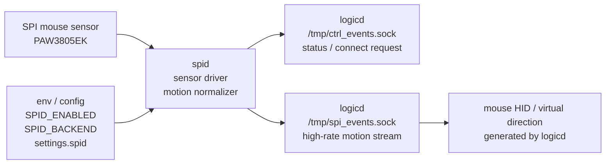

# spid

`spid` は、SPI 接続のマウスセンサを読むための optional daemon です。

対応センサ:

- `PAW3805EK`

## 方針

`spid` は常駐必須 daemon ではありません。SPI mouse sensor を搭載しない構成では、起動不要です。

既定値:

```text
SPID_ENABLED=false
SPID_BACKEND=none
```

この既定値では、`spid` は SPI も Unix socket も開かずに正常終了します。
また、誤って `SPID_ENABLED=true` だけを指定しても、`SPID_BACKEND=none` のままなら daemon socket を開かず終了します。

## 担務 / 入出力 / config 図



## なぜ logicd へ直接入れないか

SPI mouse sensor には sensor 固有の処理が多く入ります。

- reset sequence
- register read/write
- motion burst
- chip select timing
- polling rate
- CPI / resolution 設定
- axis invert / rotation / smoothing
- センサ未接続時の retry / fail-safe

これらを `logicd` から分離し、`spid` に閉じ込めます。

```text
SPI mouse sensor
  ↓ SPI
spid
  ├─ ctrl_events.sock: low-rate status / connect request
  └─ spi_events.sock: high-rate dx / dy / wheel / buttons
logicd
  ↓ mode=mouse: coalesce / rate-limit / drop stale motion
/dev/hidg0 mouse report ID 2

logicd
  ↓ mode=direction: threshold accumulation / virtual tap dispatch
keymap / macro / layer / mouse-key / lighting / BT action
```

## ctrl_events.sock と spi_events.sock

`ctrl_events.sock` は低頻度の状態通知・接続依頼だけに使います。ここへ高頻度 motion は流しません。

```json
{"t":"SPID_CONNECT","socket":"/tmp/spi_events.sock"}
{"t":"SPID_STATUS","state":"ready","sensor":"PAW3805EK","socket":"/tmp/spi_events.sock"}
{"t":"SPID_DISCONNECT"}
```

`logicd` は `SPID_CONNECT` または `SPID_STATUS ready` を受け取った時だけ `spi_events.sock` に接続します。起動時に `settings.spid.enabled` だけを見て勝手に接続はしません。

`spi_events.sock` は高頻度 motion stream 専用です。

```json
{"t":"motion","dx":3,"dy":-2,"wheel":0,"buttons":0,"sensor":"PAW3805EK"}
```

## logicd runtime mode

`logicd` 側では、`settings.spid.mode` または `LOGICD_SPID_MODE` で motion の扱いを選びます。

```json
{
  "settings": {
    "spid": {
      "mode": "mouse"
    }
  }
}
```

または:

```bash
LOGICD_SPID_MODE=direction PYTHONPATH=daemon python3 -m logicd.logicd
```

### `mode=mouse`

既定値です。

`logicd.spid_motion` が以下を行います。

- dx / dy / wheel の合算
- 最新 button state 優先
- output rate limit
- bounded buffer
- overflow 時の中抜き / drop counter
- `/dev/hidg0` mouse report ID 2 への変換

Tuning candidate:

- 現状は `LOGICD_SPID_MOTION_OUTPUT_HZ` の timer で accumulator を flush する。
- Linux HID gadget は USB IN polling token を userspace callback として直接通知しない。
- 次の候補は `/dev/hidg0` の writable/backpressure を見て、書ける状態になった時点の最新 accumulator を mouse report ID 2 として 1 report だけ送る方式。
- 近い TODO は analog stick / joystick 由来の mouse report を SPID mouse sensor と同じ scheduler に合流させること。
- 古い mouse report を複数 queue しすぎないことを優先し、timer flush は fallback / 比較用として残す。

### `mode=direction`

relative motion を analog stick のような仮想方向入力へ変換します。

設定例:

```json
{
  "settings": {
    "spid": {
      "mode": "direction",
      "direction": {
        "name": "ball",
        "up": [1, 0],
        "down": [1, 1],
        "left": [1, 2],
        "right": [1, 3],
        "threshold": 24,
        "max_taps_per_flush": 4,
        "tap_hold_sec": 0.010,
        "tap_gap_sec": 0.0
      }
    }
  }
}
```

flow:

```text
spid motion dx/dy
  ↓ threshold accumulation
left / right / up / down tap request
  ↓ logicd.spid_direction_actions
normal action pipeline
  ↓
keymap / macro / layer / mouse-key / lighting / BT action
```

現在できること:

- relative motion を threshold で消費し、上下左右の bounded tap request を生成する
- `logicd.spid_direction_actions` で tap request を press/release action として dispatch する
- `settings.spid.mode=direction` で high-rate reader から virtual direction path へ入る
- 既存の `dispatch_action_event()` を使うため、keymap / layer / macro / mouse-key / lighting / BT action と同じ経路を使える
- 実機なしテストで mapper / dispatch bridge / runtime settings を確認する

まだ残っていること:

- 実機で trackball / mouse sensor の体感しきい値を調整
- HTTP UI から mode / threshold / direction coordinate を見せるか検討

## backend

現在の backend:

| backend | 状態 |
|---|---|
| `none` | daemon 起動なし。センサなし構成用 |
| `mock` | 実機なし plumbing / test 用 |
| `PAW3805EK` | Linux spidev polling backend 実装済み。CS0 試験機で ID 読みと `logicd.spid_motion` report 生成まで確認済み |

## PAW3805EK backend

`PAW3805EK` backend は、以前の QMK 実装 `cqa02303/hfk/right/paw3805ek.c` の実機確認済み情報を参考に、`spid` 用に新規実装した polling backend です。

主な仕様:

- Linux `spidev` を使用
- 既定 SPI bus/device: `0.0`
- SPI mode: `3`
- SPI speed: `2 MHz`
- Product ID: `0x31`
- Revision ID: `0x61`
- motion register の bit 7 を確認
- X/Y delta は 12-bit two's complement として変換
- 既定 CPI: `200`

配線:

| SPI0 signal | Raspberry Pi GPIO | Linux device |
|---|---:|---|
| `CS1` | `GPIO07` | `/dev/spidev0.1` |
| `CS0` | `GPIO08` | `/dev/spidev0.0` |
| `RX` / MISO | `GPIO09` | bus `0` |
| `TX` / MOSI | `GPIO10` | bus `0` |
| `SCK` | `GPIO11` | bus `0` |

マウスセンサ試験機は SPI0 `CS0` / `GPIO08` に接続します。`SPID_SPI_DEVICE=0` が対象です。`SPID_SPI_DEVICE=1` は `CS1` / `GPIO07` です。

注意:

- PAW3805EK は `NCS` / `SCLK` / `SDIO` の 3-wire SPI です。
- Raspberry Pi の標準 SPI0 で使う場合、センサの `SDIO` を Pi の `MOSI` / `MISO` 双方へ適切に合流させます。
- 4-wire 前提で `MOSI` と `MISO` をセンサ側の別ピンへ分ける配線では Product ID が読めません。
- 2026-05-22 の CS0 試験機では、配線見直し後に `Product ID=0x31` / `Revision ID=0x61` を確認しました。
- 同試験機で `spid -> /tmp/spi_events.sock -> logicd.spid_motion` による mouse HID report 生成までは確認済みです。
- 実際の USB host 上で `/dev/hidg0` mouse report ID 2 のカーソルが期待方向・期待感度で動くかの体感確認は未実施です。これは後工程で扱います。

環境変数:

| 変数 | 既定値 | 内容 |
|---|---:|---|
| `SPID_SPI_BUS` | `0` | SPI bus |
| `SPID_SPI_DEVICE` | `0` | SPI device / chip select |
| `SPID_SPI_SPEED_HZ` | `2000000` | SPI clock |
| `SPID_SPI_MODE` | `3` | SPI mode |
| `SPID_PAW3805EK_CPI` | `200` | 初期 CPI |
| `SPID_PAW3805EK_SCALE` | `1.0` | dx/dy multiplier |

Raspberry Pi 側では `python3-spidev` と SPI 有効化が必要です。

```bash
sudo apt install python3-spidev
sudo raspi-config
# Interface Options -> SPI -> Enable
```

起動例:

```bash
SPID_ENABLED=true SPID_BACKEND=PAW3805EK SPID_SPI_DEVICE=0 PYTHONPATH=daemon python3 -m spid.spid
```

CE1 を使う場合:

```bash
SPID_ENABLED=true SPID_BACKEND=PAW3805EK SPID_SPI_DEVICE=1 PYTHONPATH=daemon python3 -m spid.spid
```

## 起動例

センサなし構成では起動不要です。

明示的に起動しても、既定では disabled として終了します。

```bash
PYTHONPATH=daemon python3 -m spid.spid
```

mock backend で plumbing を確認する場合:

```bash
SPID_ENABLED=true SPID_BACKEND=mock PYTHONPATH=daemon python3 -m spid.spid
```

PAW3805EK backend:

```bash
SPID_ENABLED=true SPID_BACKEND=PAW3805EK PYTHONPATH=daemon python3 -m spid.spid
```

## socket protocol

初期 protocol は JSON Lines です。

```json
{"t":"motion","dx":3,"dy":-2,"wheel":0,"buttons":0,"sensor":"PAW3805EK"}
{"t":"status","sensor":"PAW3805EK","ok":false,"msg":"sensor read failed"}
```

高速化が必要になった場合は binary frame を検討します。ただし protocol / packet size を変える場合は、実装前に相談します。

## systemd

unit:

```text
system/systemd/spid.service
```

fresh install で unit file を配置しても、default enable はしない方針です。SPI mouse sensor を搭載した個体だけ enable します。

```bash
sudo systemctl disable spid
sudo systemctl enable --now spid
```

unit 内の既定値も disabled です。

```text
SPID_ENABLED=false
SPID_BACKEND=none
```

## テスト

```bash
python3 script/test_spid_suite.py
```

個別に実行する場合:

```bash
python3 script/test_spid_protocol.py
python3 script/test_spid_backend.py
python3 script/test_spid_daemon.py
python3 script/test_logicd_spid_motion.py
python3 script/test_logicd_ctrl_spid.py
python3 script/test_logicd_spid_direction.py
python3 script/test_logicd_spid_direction_actions.py
python3 script/test_logicd_spid_runtime.py
```

## 次の実装 / 実機確認

1. Raspberry Pi 側の SPI pin / CE0 or CE1 / 配線を確定
2. `python3-spidev` と SPI 有効化を実機で確認
3. `SPID_ENABLED=true SPID_BACKEND=PAW3805EK` で Product ID / Revision ID が読めることを確認済み
4. PAW3805EK 実 motion を `logicd.spid_motion` 経由で mouse HID report へ変換するところまで確認済み
5. `/dev/hidg0` mouse report ID 2 の実カーソル移動、方向、感度、CPI / scale の体感確認は、PAW3805EK mounted cursor / settings UI design として TODO へ昇格済み
6. threshold / repeat / deadzone の体感調整も同 TODO で設定 UI と実機確認手順を固定する
