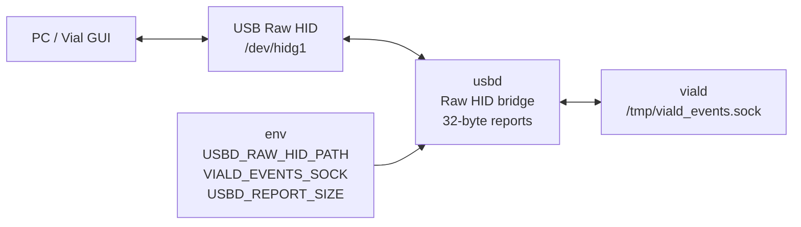

# usbd

`usbd` は USB gadget device file と内部 daemon を橋渡しする USB bridge daemon です。

## 役割

`usbd` が持つ責務:

- `/dev/hidg1` Raw HID を読み書きする
- Raw HID 32-byte report を `viald` の socket へ橋渡しする
- opt-in 時だけ Windows IME Raw HID multiplex frame を local socket から `/dev/hidg1` へ書く
- opt-in 時だけ keyboard / mouse / consumer control の canonical payload を local socket で受け、
  現在の USB gadget profile に合わせて Report ID / endpoint を付けて `/dev/hidg*` へ書く
- `/dev/hidg1` や `viald` socket の切断時に再接続する

`usbd` が持たない責務:

- Vial protocol の解釈
- keymap / layer / macro 処理
- keyboard HID report 生成
- Bluetooth HID 処理
- LED frame 生成

Vial protocol の解釈は `viald` が担当します。

## 担務 / 入出力 / config 図



## 現在の経路

```text
PC / Vial GUI
  ↓ /dev/hidg1 Raw HID 32 bytes
usbd
  ↓ /tmp/viald_events.sock
viald
```

`usbd` は packet の中身を理解せず、fixed 32-byte Raw HID report として bridge します。

## USB HID report broker

`/dev/hidg0` が keyboard / mouse / consumer control multi-report HID になったため、
USB report の最終形を複数箇所で組み立てると、Report ID 付与漏れが起きやすい。
`usbd` は opt-in の USB HID report broker を持ち、`logicd` や helper は canonical payload だけを送れる。

```text
logicd / smoke helper
  -> /tmp/usbd_hid_reports.sock
       kind=keyboard payload=8 bytes
       kind=mouse payload=4 bytes
       kind=consumer payload=2 bytes
usbd
  -> current profile: /dev/hidg0 report ID 1/2/3
```

現在のbroker contractには encode/decode helper、current multi-report profile adapter、
`USBD_HID_REPORT_LOG=1`の size / hex loggingが含まれます。brokerは既定無効のopt-in経路で、
通常のlive `logicd`出力を暗黙には差し替えません。
詳細は [docs/daemon/specs/hidd/usb-gadget-multi-report-plan.md](../../docs/daemon/specs/hidd/usb-gadget-multi-report-plan.md) を参照します。

`logicd` 側の opt-in backend も準備済みです。実機で broker 経由を試す時は、`usbd` と `logicd`
の両方を有効化します。

Mouse motion は broker 有効時だけ `usbd` の outlet scheduler で合算します。broker 無効時の
direct USB writer は従来通り Report ID を付けて即時 write し、auto が BT へ落ちた場合は
`btd` へ mouse report を渡します。auto が uinput へ落ちた場合は、uinput mouse backend が
まだ無いため mouse report を drop します。

```ini
# usbd.service drop-in
Environment=USBD_HID_REPORT_SOCKET_ENABLED=1
Environment=USBD_HID_REPORT_LOG=1

# logicd.service drop-in
Environment=LOGICD_USBD_HID_REPORT_BROKER=1
Environment=LOGICD_HID_REPORT_LOG=1
```

## Windows IME Raw HID multiplex

`<keyboard-host>` では 5本目の USB HID function が使えなかったため、Windows IME custom route は
既存 `/dev/hidg1` Raw HID endpoint の multiplex を候補にします。
既定では無効です。`USBD_WINDOWS_IME_SOCKET_ENABLED=1` の時だけ
`/tmp/usbd_windows_ime.sock` を datagram socket として開き、受け取った 32 byte frame を
`/dev/hidg1` へ書きます。

```bash
USBD_WINDOWS_IME_SOCKET_ENABLED=1 PYTHONPATH=daemon python3 -m usbd.usbd
python3 script/send_windows_ime_raw_hid_frame.py KC_HENKAN
```

frame 形式は [docs/input/windows-ime-raw-hid-multiplex-design.md](../../docs/input/windows-ime-raw-hid-multiplex-design.md) に固定します。
Vial Raw HID と同じ endpoint を共有するため、Windows receiver PoC で raw frame の表示受信が確認できるまでは
IME 注入や automatic routing へ進めません。

## Bluetooth との違い

Bluetooth HID は `btd` の責務です。

```text
USB Raw HID bridge: usbd
Bluetooth HID:      btd
```

`usbd` は BlueZ / BLE / pairing / GATT service registration を扱いません。

## 環境変数

| 変数 | デフォルト | 説明 |
|---|---|---|
| `USBD_RAW_HID_PATH` | `/dev/hidg1` | Raw HID device path |
| `VIALD_EVENTS_SOCK` | `/tmp/viald_events.sock` | viald socket |
| `USBD_REPORT_SIZE` | `32` | Raw HID report size |
| `USBD_RETRY_SEC` | `1.0` | reconnect interval |
| `USBD_SOCKET_TIMEOUT_SEC` | `2.0` | socket timeout |
| `USBD_WINDOWS_IME_SOCKET_ENABLED` | `0` | Windows IME Raw HID multiplex socket を有効化 |
| `USBD_WINDOWS_IME_SOCKET` | `/tmp/usbd_windows_ime.sock` | Windows IME Raw HID frame 送信用 local socket |
| `USBD_HID_REPORT_SOCKET_ENABLED` | `0` | USB HID report broker socket を有効化 |
| `USBD_HID_REPORT_SOCKET` | `/tmp/usbd_hid_reports.sock` | keyboard / mouse / consumer report request socket |
| `USBD_HID_REPORT_LOG` | `0` | broker の endpoint / length / hex log を有効化 |

## systemd

unit:

```text
system/systemd/usbd.service
```

操作例:

```bash
sudo systemctl start usbd
sudo systemctl restart usbd
sudo systemctl status usbd
journalctl -u usbd -f
```

現行 service 構成では `usbd.service` が `viald.service` を `Requires=` します。

## 確認

viald protocol の local test:

```bash
python3 script/test_vial_protocol.py
```

Host 側 Raw HID 往復確認:

```bash
python script/test_vial_raw_hid_host.py
```

`viald` restart 後の復旧も確認します。

```bash
sudo systemctl restart viald
python script/test_vial_raw_hid_host.py
```

## 注意

- `script/test_viald_echo.py` は Stage 1 の echo 実装時に使った履歴用 smoke test です。
- 通常確認では Vial protocol tests を使います。
- `/dev/hidg0` は keyboard / mouse / consumer control multi-report HID、`/dev/hidg1` は Raw HID / Vial です。

関連:

- [`daemon/viald/README.md`](../viald/README.md)
- [`docs/daemon/specs/viald/architecture.md`](../../docs/daemon/specs/viald/architecture.md)
- [`docs/vial/implementation-plan.md`](../../docs/vial/implementation-plan.md)
