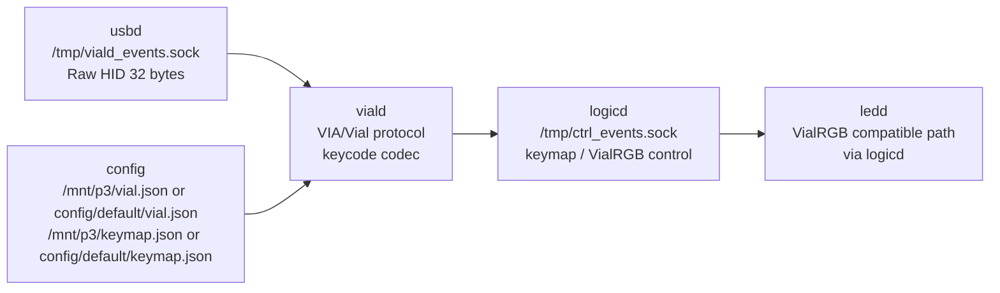

# viald

`viald` は Vial / VIA Raw HID protocol を処理する daemon です。
`usbd` から受け取った 32-byte Raw HID packet を解釈し、keymap / matrix state / VialRGB などを内部 daemon へ橋渡しします。

## 役割

`viald` が持つ責務:

- Vial / VIA Raw HID command の decode / encode
- `/mnt/p3/vial.json` または `config/default/vial.json` の compressed definition 応答
- dynamic keymap buffer の読み書き
- Vial unlock handling
- Vial keycode と project custom action の相互変換
- VialRGB command を `logicd` / `ledd` 側で扱える形へ変換

`viald` が持たない責務:

- `/dev/hidg1` の device file 直接監視
- keymap action の実行
- LED hardware 直接出力
- Bluetooth HID 処理

USB Raw HID bridge は `usbd`、keymap / layer の実行は `logicd`、LED hardware 出力は `ledd` が担当します。

## 担務 / 入出力 / config 図



## 現在の経路

```text
PC / Vial GUI
  ↓ /dev/hidg1 Raw HID
usbd
  ↓ /tmp/viald_events.sock
viald
  ↓ /tmp/ctrl_events.sock
logicd
```

VialRGB direct 相当の LED packet も、互換経路では `viald -> logicd -> ledd` を通ります。

```text
VialRGB direct compatible path
  viald
  ↓
logicd
  ↓
ledd
```

## LED / video demo との関係

`tools/demo/play_led_video.py --backend direct` は現時点では VialRGB direct 互換経路を使います。
この経路は互換性重視です。

高 FPS の内部 LED pattern については、`viald` を通さず `producer -> ledd` に近い direct-frame socket を追加済みです。
実機 FPS / CPU / dropped frame の確認は `ledd` / LED video demo 側で継続します。

関連:

- [`docs/daemon/specs/ledd/direct-frame-socket-plan.md`](../../docs/daemon/specs/ledd/direct-frame-socket-plan.md)
- [`demo/README.md`](../../demo/README.md)
- [`daemon/ledd/README.md`](../ledd/README.md)

## 対応済みコマンド

- `CMD_VIA_GET_PROTOCOL_VERSION`
- `CMD_VIA_GET_KEYBOARD_VALUE`
  - layout options
  - `VIA_SWITCH_MATRIX_STATE`
- `CMD_VIA_GET_LAYER_COUNT`
- `CMD_VIA_KEYMAP_GET_BUFFER`
- `CMD_VIA_SET_KEYCODE`
- `CMD_VIA_MACRO_GET_COUNT`
- `CMD_VIA_MACRO_GET_BUFFER_SIZE`
- `CMD_VIA_MACRO_GET_BUFFER`
- `CMD_VIA_MACRO_SET_BUFFER`
- `CMD_VIAL_GET_KEYBOARD_ID`
- `CMD_VIAL_GET_SIZE`
- `CMD_VIAL_GET_DEFINITION`
- `CMD_VIAL_GET_UNLOCK_STATUS`
- `CMD_VIAL_UNLOCK_START`
- `CMD_VIAL_UNLOCK_POLL`
- `CMD_VIAL_LOCK`
- `CMD_VIAL_QMK_SETTINGS_QUERY`
  - `combo_term`, `tapping_term`, `hold_on_other_key_press`
- `CMD_VIAL_QMK_SETTINGS_GET` / `SET` / `RESET`
- `CMD_VIAL_DYNAMIC_ENTRY_OP`
  - Tap Dance count / get / set
  - Combo count / get / set
- VialRGB `GET_INFO` / `GET_SUPPORTED` / `GET_MODE` / `SET_MODE` / `DIRECT_FASTSET`

## 制限

- Vial unlock は `vial.unlockKeys` の matrix 座標を hold する最小実装です。
- Vial Tap Dance は `On tap` / `On hold` / `On double tap` / `On tap + hold` /
  `Tapping term` を `settings.interaction.tap_dances` へ橋渡しします。
- Vial Combo は layer 0 の現在の keycode から matrix 座標へ逆引きして
  `settings.interaction.combos` へ橋渡しします。layer 0 に存在しない keycode は
  combo key として保存できません。
- Vial Key Override は required modifier + negative modifier + trigger key +
  replacement key + layer mask + option flags を `settings.interaction.key_overrides`
  へ橋渡しします。suppressed mod は保存・復元しますが、実行時の modifier 抑制は
  互換拡張対象です。
- Vial QMK Settings は Combo Term / Tapping Term / Hold On Other Key Press のみ対応します。
- Vial Macro は raw buffer を `settings.vial_macro_buffer` に保持し、実行用に
  `MACRO:VIAL0` から `MACRO:VIAL7` へ橋渡しします。text / tap / down / up / delay は
  実行用 macro token へ変換します。
- `SCRIPT(...)` の任意名 action は Vial GUI へは出しません。
- Vial GUI から割り当てる script は `KC_SH0`〜`KC_SH10` の custom keycode として扱います。
- 連続 SET 時の保存 debounce は未実装です。必要なら `VIALD_SAVE_ON_SET=0` で自動保存を止められます。

## 関連ファイル

- `config/default/vial.json`
- [`docs/daemon/specs/viald/architecture.md`](../../docs/daemon/specs/viald/architecture.md)
- [`docs/vial/implementation-plan.md`](../../docs/vial/implementation-plan.md)
- [`docs/lighting/vialrgb-protocol.md`](../../docs/lighting/vialrgb-protocol.md)
- [`docs/keycode/qmk-vial-keycode-support.md`](../../docs/keycode/qmk-vial-keycode-support.md)

## 確認

Vial protocol smoke test:

```bash
python3 script/test_vial_protocol.py
```

VialRGB protocol test:

```bash
python3 script/test_vialrgb_protocol.py
```

`ledd` 側の VialRGB mode 処理を hardware なしで確認する場合:

```bash
python3 script/test_vialrgb_ledd.py
```

Vial keycode codec:

```bash
python3 script/test_vial_keycode_codec.py
```

protocol dispatcher local test:

```bash
python3 script/test_vial_protocol_local.py
```

実サービスの Matrix Test 経路:

```bash
sudo python3 script/test_vial_matrix_state_runtime.py
```

実サービスの unlock 経路:

```bash
sudo python3 script/test_vial_unlock_runtime.py
```

Host 側 Raw HID 往復確認:

```bash
python script/test_vial_raw_hid_host.py
```

## 注意

`script/test_viald_echo.py` は Stage 1 の echo 実装時に使った履歴用 smoke test です。現在の通常確認では Vial protocol tests を使います。
