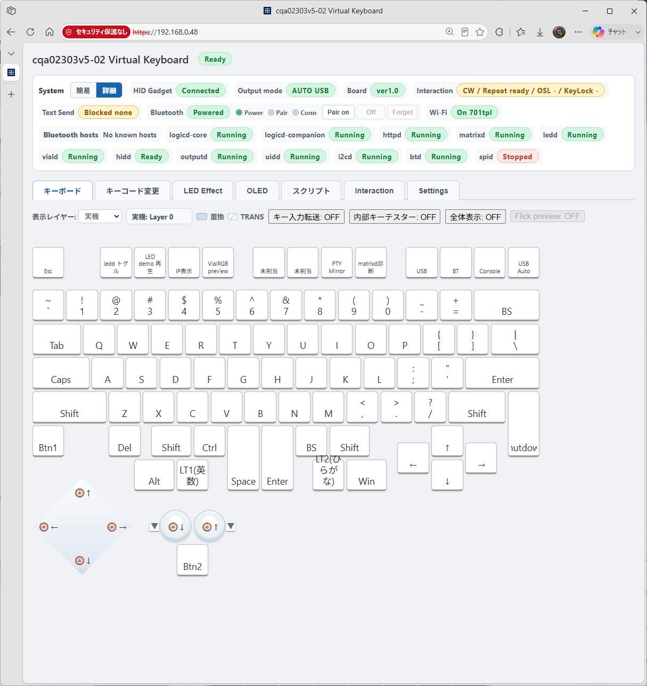

# 画像ギャラリー

HIDloomの実機、Web UI、タッチパネル候補の画像をカテゴリ別に掲載しています。

まず見る文書:

- このカテゴリには画像一覧以外の独立文書はありません。

文書一覧:

- このカテゴリ直下には追加文書はありません。

| カテゴリ | プレビュー | 内容 |
|---|---|---|
| [CQA02303v5](cqa02303v5/README.md) |  | PCB、試作機、展示、完成機 |
| [Web UI](WebUI/README.md) |  | キーボード、keymap、LED、OLED、script、interaction、settings |
| [Touch panel](touchpanel/README.md) |  | タッチパネル候補 |

[プロジェクトTOPへ戻る](../../README.md)
