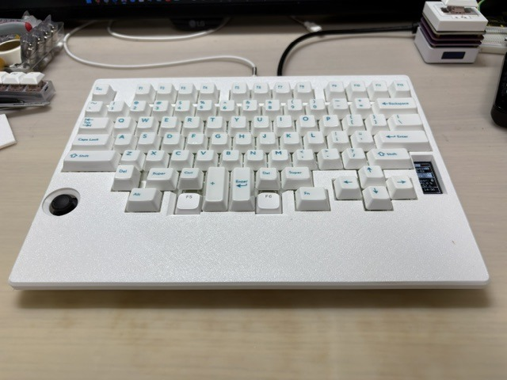
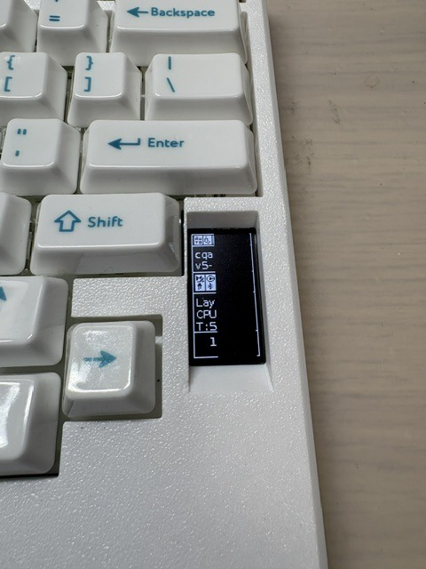
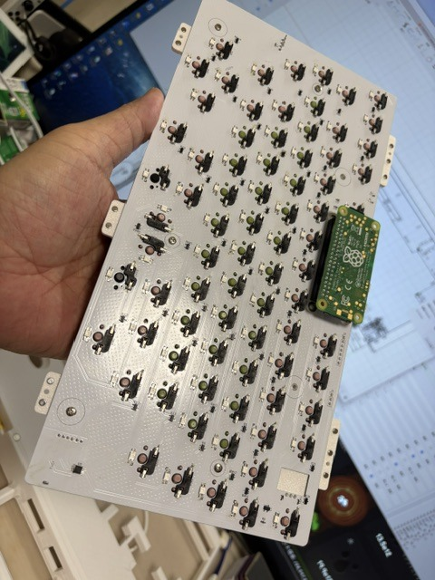
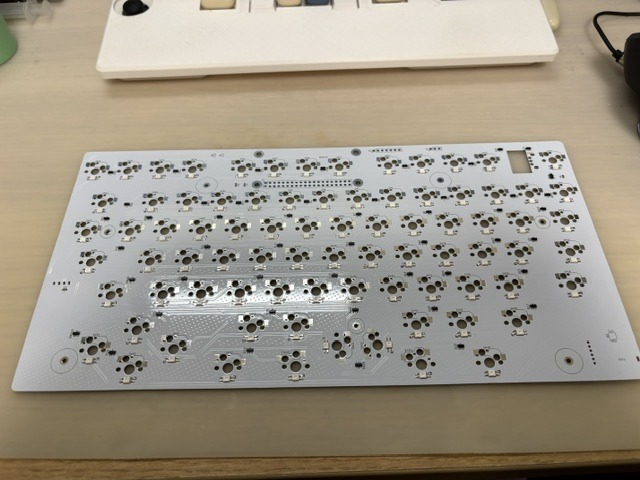
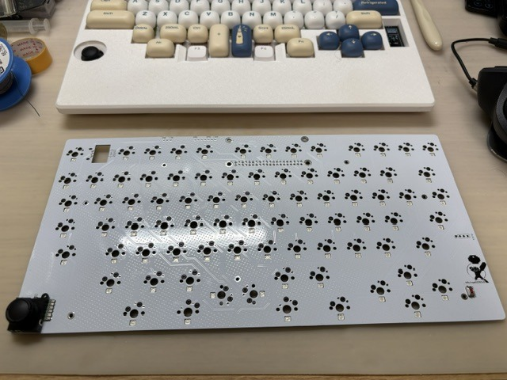
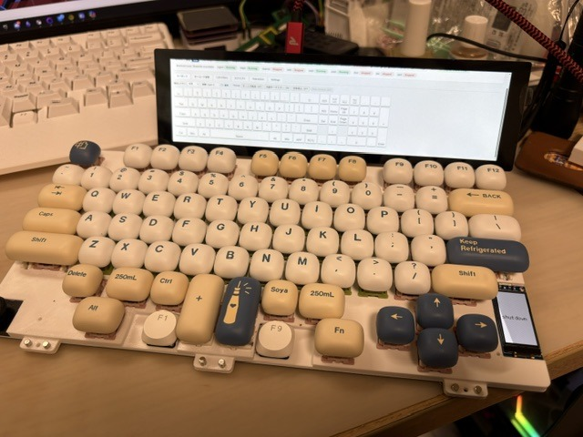
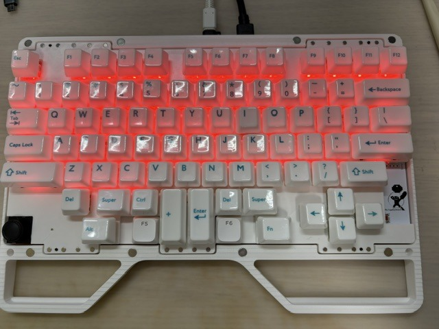
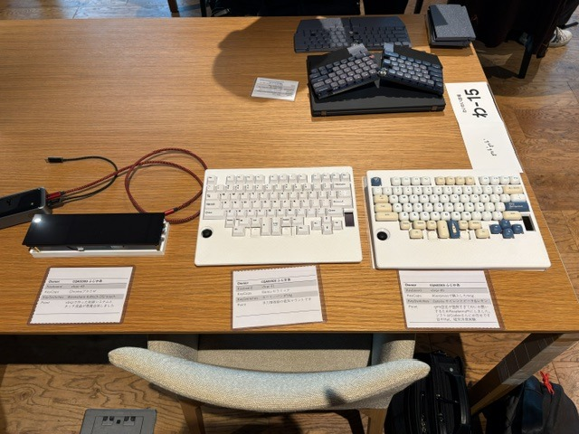

# CQA02303v5

[ギャラリーTOPへ戻る](../README.md)

## 完成機

| 正面 | OLEDステータス表示 |
|---|---|
|  |  |

## 製作・試作

| PCBとRaspberry Pi Zero | スイッチマトリクス |
|---|---|
|  |  |

| ロータリーエンコーダー付きPCB | レイアウト表示付き試作機 |
|---|---|
|  |  |

| オープンフレーム・赤色バックライト | 展示風景 |
|---|---|
|  |  |
